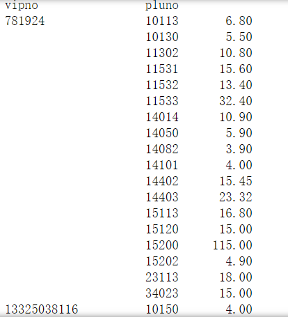
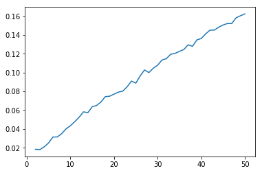
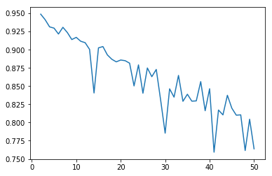
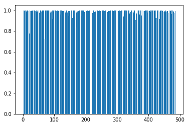

# 数据挖掘作业q1

作者：王星洲

学号：1652977

### 步骤一

```python
# 读入数据所序列
df = pd.read_csv("../trade_new.csv", usecols=["vipno", "pluno", "amt"])
# 把pluno列取为第四级商品编号
df["pluno"] = (df["pluno"]/1000).astype(int)
# 分组，求和
df = df.groupby(["vipno","pluno"]).sum()
```

运行结果：



### 步骤二

```python
def jaccard_dist(a, b):
    fenzi = 0
    fenmu = 0
    for i in range(a.size):
        fenzi += min(a[i],b[i])
        fenmu += max(a[i],b[i])
    return 1-(fenzi/fenmu)
```

### 步骤三

```python
def initCentroids(dataSet, k):#dataSet-数据点数组 k-设置的质心数
    #初始化质心 
    numSamples, dim = dataSet.shape#numSample-数据点个数 dim-数据点维数 
    #shape返回一个关于数组长宽的数组
    centroids = np.zeros((k, dim))#centroids-存放质心的数组
    index = random.sample(range(0, numSamples), k)#index-在零到数据点个数间的随机数
    print(index)
    for i in range(len(index)):
        centroids[i, :] = dataSet.values[index[i], :]
    #将随机质心存储入centroids
    return centroids


def CP(label, k, centroids, dataSet):
    cpnum = 0
    for i in range(k):
        distance = 0
        num = 0
        for j in range(len(label)):
            if label[j] == i:
                distance += jaccard_dist(dataSet.values[j,:],centroids[i,:])
                num += 1
        cpnum += distance/num
    return cpnum/k


def getCentroid(dataSet):
    div = len(dataSet)
    return sum(dataSet)/div


def getSC(dataSet, label):
    sum_number = 0
    k = len(label)
    for i in range(k):
        ai = 0
        bi = 0
        anum = 0
        bnum = 0
        for j in range(k):
            if label[i]==label[j]:
                ai += jaccard_dist(dataSet.values[i,:],dataSet.values[j,:])
                anum += 1
            else:
                bi += jaccard_dist(dataSet.values[i,:],dataSet.values[j,:])
                bnum += 1
        ai = ai / anum
        bi = bi / bnum
        sum_number += (bi - ai) / max(ai, bi)     
    return sum_number / k


def kmeans(dataSet, k):
    #k-means算法的核心函数
    numSamples = dataSet.shape[0]#数据点个数为数据点数组的行数
    label=np.zeros(dataSet.shape[0])
    clusterChanged = True#clusterChanged-表示是否需要重新分组的布尔值判定量
    
    centroids = initCentroids(dataSet, k)#初始化质心
    
    while clusterChanged:#需要重新分组时
        clusterChanged = False#重置判定量为假
        for i in range(numSamples):#遍历所有数据点
            minDist = 100000.0#minDist-最小的数据点与质心的距离
            minIndex = 0#minIndex-最小的链接地址
            for j in range(k):
                #计算每个数据点到哪个质心的距离最小，及记录是哪一个质心
                distance = jaccard_dist(centroids[j, :], dataSet.values[i, :])#distance-暂时存放数据点到质心的距离，这里是jaccard距离
                if distance < minDist:
                    minDist = distance
                    minIndex = j
            if label[i] != minIndex:#当该数据点所隶属的质心与最小链接地址不同时更新点中的数据
                clusterChanged = True#重置判定量为真
                label[i] = minIndex#该数据点的第二列变为一个数组
        for j in range(k):#由新的隶属关系中更新质心位置
            pointsInCluster = []
            for m in range(len(label)):
                if label[m]==j:
                    pointsInCluster.append(dataSet.values[m, :])
            centroids[j, :] = getCentroid(pointsInCluster)
        print(label)
    print("分类完成")
    #这里计算SC
    silhouette_score = getSC(data, label)
    #这里计算CP
    compactness_score = CP(label,k,centroids,dataSet)
    print("sc:" + str(silhouette_score))
    print("cp:" + str(compactness_score))
    return silhouette_score,compactness_score


#数据准备
df = df.sort_values(by=["vipno"])
vipno_series = df["vipno"].drop_duplicates()
vipno_series = vipno_series.reset_index(drop=True)
print(vipno_series)
df = df.sort_values(by=["pluno"])
pluno_series = df["pluno"].drop_duplicates()
pluno_series = pluno_series.reset_index(drop=True)
print(pluno_series)
data = DataFrame(0, columns=pluno_series, index=vipno_series)
# print(data)
for i in df.index:
    vipno = df['vipno'][i]
    pluno = df['pluno'][i]
    amt = group_data[vipno][pluno]
    if math.isnan(data[pluno][vipno]):
        data[pluno][vipno] = amt
    else:
        data[pluno][vipno] += amt
       

#进行聚类
silhouette_score_array = []
for i in range(2,51):#从K为2到K为50，尝试一下
    silhouette_score_array.append(kmeans(data, i))
```

运行结果：

```
[(0.01833235049925799, 0.9488639667901324), (0.01798931573043937, 0.9412414702059895), (0.02094337519143109, 0.9313847648592024), (0.02514653566404093, 0.9296559790380703), (0.031391170578805666, 0.9215624653625035), (0.0314417911421359, 0.9307869155167605), (0.03499876409962116, 0.9235706692524293), (0.04007431022388544, 0.9139491836554234), (0.0433962953240581, 0.9169783971115371), (0.04773129257490006, 0.9116483079744434), (0.05241878694777956, 0.9096732677005995), (0.05815230793189491, 0.9003977309682809), (0.05733159381634656, 0.840543030563803), (0.06357454202819898, 0.9025543811912513), (0.06498213632038577, 0.9043282788858121), (0.06861539695812925, 0.8928800676546692), (0.07435441259346143, 0.8868902640464662), (0.07481460125223427, 0.8833308993874629), (0.07701219806145809, 0.8858541038566077), (0.07915981331708787, 0.884936297748823), (0.08024824775137396, 0.8815238983617127), (0.08474550111956175, 0.8502468654323445), (0.09089251114422497, 0.8791706866017154), (0.08870752888989072, 0.8402152339127408), (0.09643438565486688, 0.8749197592537699), (0.10275254493248798, 0.862935239825473), (0.09994069570930138, 0.8729123637574928), (0.10455924600545538, 0.83018415589739), (0.10782668835971844, 0.7853585988310193), (0.11331040507705015, 0.8462749681100166), (0.11473061855499292, 0.834874583264884), (0.11943409481128404, 0.8647040582216089), (0.12037415102280426, 0.829127134147664), (0.12252200299747812, 0.8388242216471395), (0.12444788220575075, 0.8293156030946256), (0.1294886794123134, 0.8296866688479446), (0.12785095349306985, 0.8562056554356247), (0.1347510584296725, 0.8161889198783421), (0.13618654279521572, 0.8463994744646819), (0.14100397007479637, 0.7592215594594506), (0.1451168719988695, 0.817114397629069), (0.14512165808620575, 0.8104843775262333), (0.14821632595646872, 0.8374052742622954), (0.15058478166267594, 0.819678218320547), (0.15214947812394544, 0.8100759597929137), (0.1521399570261097, 0.8105386693875134), (0.1582282615282464, 0.7615221769051979), (0.1604202891667947, 0.8045381727784442), (0.16238979409226034, 0.7638493320292986)]
```

|  K   |    SC    |    CP    |
| :--: | :------: | :------: |
|  2   | 0.018332 | 0.948864 |
|  3   | 0.017989 | 0.941241 |
|  4   | 0.020943 | 0.931385 |
|  5   | 0.025147 | 0.929656 |
|  6   | 0.031391 | 0.921562 |
|  7   | 0.031442 | 0.930787 |
|  8   | 0.034999 | 0.923571 |
|  9   | 0.040074 | 0.913949 |
|  10  | 0.043396 | 0.916978 |
|  11  | 0.047731 | 0.911648 |
|  12  | 0.052419 | 0.909673 |
|  13  | 0.058152 | 0.900398 |
|  14  | 0.057332 | 0.840543 |
|  15  | 0.063575 | 0.902554 |
|  16  | 0.064982 | 0.904328 |
|  17  | 0.068615 | 0.892880 |
|  18  | 0.074354 | 0.886890 |
|  19  | 0.074815 | 0.883331 |
|  20  | 0.077012 | 0.885854 |
|  21  | 0.079160 | 0.884936 |
|  22  | 0.080248 | 0.881524 |
|  23  | 0.084746 | 0.850247 |
|  24  | 0.090893 | 0.879171 |
|  25  | 0.088708 | 0.840215 |
|  26  | 0.096434 | 0.874920 |
|  27  | 0.102753 | 0.862935 |
|  28  | 0.099941 | 0.872912 |
|  29  | 0.104559 | 0.830184 |
|  30  | 0.107827 | 0.785359 |
|  31  | 0.113310 | 0.846275 |
|  32  | 0.114731 | 0.834875 |
|  33  | 0.119434 | 0.864704 |
|  34  | 0.120374 | 0.829127 |
|  35  | 0.122522 | 0.838824 |
|  36  | 0.124448 | 0.829316 |
|  37  | 0.129489 | 0.829687 |
|  38  | 0.127851 | 0.856206 |
|  39  | 0.134751 | 0.816189 |
|  40  | 0.136187 | 0.846399 |
|  41  | 0.141004 | 0.759222 |
|  42  | 0.145117 | 0.817114 |
|  43  | 0.145122 | 0.810484 |
|  44  | 0.148216 | 0.837405 |
|  45  | 0.150585 | 0.819678 |
|  46  | 0.152149 | 0.810076 |
|  47  | 0.152140 | 0.810539 |
|  48  | 0.158228 | 0.761522 |
|  49  | 0.160420 | 0.804538 |
|  50  | 0.162390 | 0.763849 |

*SC图像*



CP图像



### 结论

​	由于第一种方法时间复杂度较低，我跑了k=2~k=50来查看整个数据的走向，发现SC指标随着k的增大而有增大的趋势，CP随着k的增大有减小的趋势，也就是说，将用户分割的簇越多，聚类的效果就越好。我试图找到这个方法的拐点，于是我尝试了以下几个情况：

```python
#in
test_sc_cp = kmeans(data, 100)
#out
分类完成
sc:0.2814400586367718
cp:0.6221590530476161
    
#in
test_sc_cp = kmeans(data, 200)
#out
分类完成
sc:0.4892452048219227
cp:0.42969598905301626
   
#in
test_sc_cp = kmeans(data, 300)
#out
分类完成
sc:0.6793081205563909
cp:0.2279569153662718
    
#in
test_sc_cp = kmeans(data, 400)
#out
分类完成
sc:0.8553902236640973
cp:0.08733687105330117
```

可以发现，尽管我已经基本上给一个用户分一类，也还是没有发现拐点，而再进行实验已经没有意义了，没有超市需要将客户分为这么多类，聚类操作失去了实质意义。这说明了，k-means这个基于距离的方法，在这个方法中认为用户之间的差异都很大，这一点可以通过距离分布图来验证。

距离分布

```python
distance = []
for i in range(len(data)):
    distance.append(jaccard_dist(data.values[0,:], data.values[i,:]))
plt.bar(range(len(data)), distance)
```



我们可以看到，在距离分布图中，绝大部分点与0号点的距离几乎等于1，如果聚类要把它们中的某些点聚在一起一定会对聚类分析的评价产生巨大的影响。所以分类分的越碎，效果就越好。

在实际操作中，如果采取这样的距离定义，使用kmeans方法的话，我认为在可接受的类别数目种选取一个最大数目应该就是最优解了。这样的聚类策略，在这个问题上，我不推荐使用。