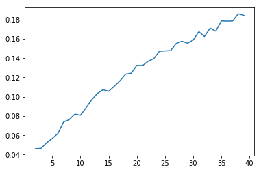
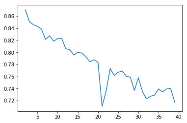
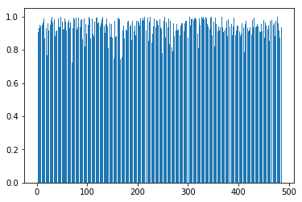

# 数据挖掘作业q2

作者：王星洲

学号：1652977

### 步骤一

```python
# 读入数据所序列
row_data = pd.read_csv("F:/CourseData/数据挖掘/datamining20/trade_new.csv")
df1 = row_data[["vipno", "pluno", "amt"]]
df2 = row_data[["vipno", "pluno", "amt"]]
df3 = row_data[["vipno", "pluno", "amt"]]
df4 = row_data[["vipno", "pluno", "amt"]]
df1["pluno"] = (df1["pluno"]/1000000).astype(int)
df2["pluno"] = (df2["pluno"]/100000).astype(int)
df3["pluno"] = (df3["pluno"]/10000).astype(int)
df4["pluno"] = (df4["pluno"]/1000).astype(int)
df1 = df1.sort_values(by=["vipno"])
vipno_series = df1["vipno"].drop_duplicates()
vipno_series = vipno_series.reset_index(drop=True)
print(vipno_series)
df1 = df1.sort_values(by=["pluno"])
pluno_series1 = df1["pluno"].drop_duplicates()
pluno_series1 = pluno_series1.reset_index(drop=True)
print(pluno_series1)
df2 = df2.sort_values(by=["pluno"])
pluno_series2 = df2["pluno"].drop_duplicates()
pluno_series2 = pluno_series2.reset_index(drop=True)
print(pluno_series2)
df3 = df3.sort_values(by=["pluno"])
pluno_series3 = df3["pluno"].drop_duplicates()
pluno_series3 = pluno_series3.reset_index(drop=True)
print(pluno_series3)
df4 = df4.sort_values(by=["pluno"])
pluno_series4 = df4["pluno"].drop_duplicates()
pluno_series4 = pluno_series4.reset_index(drop=True)
print(pluno_series4)
# 分组，求和
group_data1 = df1.groupby(["vipno","pluno"])["amt"].sum()
group_data2 = df2.groupby(["vipno","pluno"])["amt"].sum()
group_data3 = df3.groupby(["vipno","pluno"])["amt"].sum()
group_data4 = df4.groupby(["vipno","pluno"])["amt"].sum()
print(group_data1)
```

运行结果：


### 步骤二

```python
#记录：用户486个，plu一级18个，plu二级94个，plu三级329个，plu四级979个
def jaccard_dist(a, b):
    fenzi = 0
    fenmu = 0
    for i in range(0,18):
        fenzi += min(a[i],b[i])
        fenmu += max(a[i],b[i])
    sim1 = fenzi/fenmu
    fenzi = 0
    fenmu = 0
    for i in range(18,18+94):
        fenzi += min(a[i],b[i])
        fenmu += max(a[i],b[i])
    sim2 = fenzi/fenmu
    fenzi = 0
    fenmu = 0
    for i in range(18+94,18+94+329):
        fenzi += min(a[i],b[i])
        fenmu += max(a[i],b[i])
    sim3 = fenzi/fenmu
    fenzi = 0
    fenmu = 0
    for i in range(18+94+329,18+94+329+979):
        fenzi += min(a[i],b[i])
        fenmu += max(a[i],b[i])
    sim4 = fenzi/fenmu
    return 1-(sim1+sim2+sim3+sim4)/4
```

### 步骤三

```python
def initCentroids(dataSet, k):#dataSet-数据点数组 k-设置的质心数
    #初始化质心 
    numSamples, dim = dataSet.shape#numSample-数据点个数 dim-数据点维数 
    #shape返回一个关于数组长宽的数组
    centroids = np.zeros((k, dim))#centroids-存放质心的数组
    index = random.sample(range(0, numSamples), k)#index-在零到数据点个数间的随机数
    print(index)
    for i in range(len(index)):
        centroids[i, :] = dataSet.values[index[i], :]
    #将随机质心存储入centroids
    return centroids

def CP(label, k, centroids, dataSet):
    cpnum = 0
    for i in range(k):
        distance = 0
        num = 0
        for j in range((len(label))):
            if label[j] == i:
                distance += jaccard_dist(dataSet.values[j,:],centroids[i,:])
                num += 1
        cpnum += distance/num
    return cpnum/k


def getCentroid(dataSet):
    div = len(dataSet)
    return sum(dataSet)/div


def getSC(dataSet, label):
    sum_number = 0
    k = len(label)
    for i in range(k):
        ai = 0
        bi = 0
        anum = 0
        bnum = 0
        for j in range(k):
            if label[i]==label[j]:
                ai += jaccard_dist(dataSet.values[i,:],dataSet.values[j,:])
                anum += 1
            else:
                bi += jaccard_dist(dataSet.values[i,:],dataSet.values[j,:])
                bnum += 1
        ai = ai / anum
        bi = bi / bnum
        sum_number += (bi - ai) / max(ai, bi)     
    return sum_number / k


def kmeans(dataSet, k):
    #k-means算法的核心函数
    numSamples = dataSet.shape[0]#数据点个数为数据点数组的行数
    label=np.zeros(dataSet.shape[0])
    clusterChanged = True#clusterChanged-表示是否需要重新分组的布尔值判定量
    
    centroids = initCentroids(dataSet, k)#初始化质心
    
    while clusterChanged:#需要重新分组时
        clusterChanged = False#重置判定量为假
        for i in range(numSamples):#遍历所有数据点
            minDist = 100000.0#minDist-最小的数据点与质心的距离
            minIndex = 0#minIndex-最小的链接地址
            for j in range(k):
                #计算每个数据点到哪个质心的距离最小，及记录是哪一个质心
                distance = jaccard_dist(centroids[j, :], dataSet.values[i, :])#distance-暂时存放数据点到质心的距离，这里是jaccard距离
                if distance < minDist:
                    minDist = distance
                    minIndex = j
            if label[i] != minIndex:#当该数据点所隶属的质心与最小链接地址不同时更新点中的数据
                clusterChanged = True#重置判定量为真
                label[i] = minIndex#该数据点的第二列变为一个数组
        for j in range(k):#由新的隶属关系中更新质心位置
            pointsInCluster = []
            for m in range(len(label)):
                if label[m]==j:
                    pointsInCluster.append(dataSet.values[m, :])
            centroids[j, :] = getCentroid(pointsInCluster)
        print(label)
    print("分类完成")
    #这里计算SC
    silhouette_score = getSC(data, label)
    #这里计算CP
    compactness_score = CP(label,k,centroids,dataSet)
    print("sc:" + str(silhouette_score))
    print("cp:" + str(compactness_score))
    return silhouette_score,compactness_score


#数据准备
data1 = DataFrame(0, columns=pluno_series1, index=vipno_series)
# print(data)
for i in df1.index:
    vipno = df1['vipno'][i]
    pluno = df1['pluno'][i]
    amt = group_data1[vipno][pluno]
    if math.isnan(data1[pluno][vipno]):
        data1[pluno][vipno] = amt
    else:
        data1[pluno][vipno] += amt
data2 = DataFrame(0, columns=pluno_series2, index=vipno_series)
# print(data)
for i in df2.index:
    vipno = df2['vipno'][i]
    pluno = df2['pluno'][i]
    amt = group_data2[vipno][pluno]
    if math.isnan(data2[pluno][vipno]):
        data2[pluno][vipno] = amt
    else:
        data2[pluno][vipno] += amt
data3 = DataFrame(0, columns=pluno_series3, index=vipno_series)
# print(data)
for i in df1.index:
    vipno = df3['vipno'][i]
    pluno = df3['pluno'][i]
    amt = group_data3[vipno][pluno]
    if math.isnan(data3[pluno][vipno]):
        data3[pluno][vipno] = amt
    else:
        data3[pluno][vipno] += amt
data4 = DataFrame(0, columns=pluno_series4, index=vipno_series)
# print(data)
for i in df4.index:
    vipno = df4['vipno'][i]
    pluno = df4['pluno'][i]
    amt = group_data4[vipno][pluno]
    if math.isnan(data4[pluno][vipno]):
        data4[pluno][vipno] = amt
    else:
        data4[pluno][vipno] += amt
data = pd.concat([data1, data2, data3, data4],axis=1)


silhouette_score_array = []
for i in range(2,40):#从K为2到K为39，尝试一下
    silhouette_score_array.append(kmeans(data, i))
```

运行结果：

```
[(0.046009060242664455, 0.8703314634660553), (0.04639800140986168, 0.8507745782471007), (0.05223778588281045, 0.8456376368168257), (0.0566935590430981, 0.8431493097538644), (0.06192274837863743, 0.8381479902059875), (0.07376180474905145, 0.8213263839704223), (0.07619498835114803, 0.8275969889541755), (0.08196899003053335, 0.8183985455356022), (0.08084097548653246, 0.8227424299647964), (0.08860153147888537, 0.823448835207196), (0.09692827131098074, 0.8059556649567884), (0.10340349963964743, 0.804504663043267), (0.10734198666238734, 0.795502089742313), (0.10567994045519696, 0.8000799221307303), (0.11088282728752352, 0.7987122184817311), (0.11648661299222518, 0.7925162285447176), (0.12333206200997812, 0.7843122079991169), (0.12441300679296502, 0.7877305175020182), (0.13252647848121082, 0.7833612522715192), (0.13229130338814887, 0.7103942757034106), (0.13677147198394154, 0.7354396374295498), (0.13937959430553268, 0.7729682405904812), (0.14715264498363456, 0.7618160925415621), (0.147492899268557, 0.7668674654821456), (0.14784667225537074, 0.7691730476012262), (0.1552782580506372, 0.7601830177832005), (0.15751860731467987, 0.7589987317722463), (0.15546415700476252, 0.7367407975129647), (0.15877971943254068, 0.7579979619890335), (0.16751464692397214, 0.7347685734583977), (0.16244209603561277, 0.7228220673242257), (0.1711096423479383, 0.7272031881809556), (0.16806317873181773, 0.7289864361421701), (0.17860849824890354, 0.7394203609998274), (0.1783595849139852, 0.7344277601077048), (0.1785540606823688, 0.7393803836497161), (0.18602698564752815, 0.7397692607809426), (0.1843704923390654, 0.7173760381444888)]
```

|  K   |    SC    |    CP    |
| :--: | :------: | :------: |
|  2   | 0.046009 | 0.870331 |
|  3   | 0.046398 | 0.850775 |
|  4   | 0.052238 | 0.845638 |
|  5   | 0.056694 | 0.843149 |
|  6   | 0.061923 | 0.838148 |
|  7   | 0.073762 | 0.821326 |
|  8   | 0.076195 | 0.827597 |
|  9   | 0.081969 | 0.818399 |
|  10  | 0.080841 | 0.822742 |
|  11  | 0.088602 | 0.823449 |
|  12  | 0.096928 | 0.805956 |
|  13  | 0.103403 | 0.804505 |
|  14  | 0.107342 | 0.795502 |
|  15  | 0.105680 | 0.800080 |
|  16  | 0.110883 | 0.798712 |
|  17  | 0.116487 | 0.792516 |
|  18  | 0.123332 | 0.784312 |
|  19  | 0.124413 | 0.787731 |
|  20  | 0.132526 | 0.783361 |
|  21  | 0.132291 | 0.710394 |
|  22  | 0.136771 | 0.735440 |
|  23  | 0.139380 | 0.772968 |
|  24  | 0.147153 | 0.761816 |
|  25  | 0.147493 | 0.766867 |
|  26  | 0.147847 | 0.769173 |
|  27  | 0.155278 | 0.760183 |
|  28  | 0.157519 | 0.758999 |
|  29  | 0.155464 | 0.736741 |
|  30  | 0.158780 | 0.757998 |
|  31  | 0.167515 | 0.734769 |
|  32  | 0.162442 | 0.722822 |
|  33  | 0.171110 | 0.727203 |
|  34  | 0.168063 | 0.728986 |
|  35  | 0.178608 | 0.739420 |
|  36  | 0.178360 | 0.734428 |
|  37  | 0.178554 | 0.739380 |
|  38  | 0.186027 | 0.739769 |
|  39  | 0.184370 | 0.717376 |

*SC图像*



*CP图像*



### 结论

​	可以看到SC和CP的走向和第一种方法差不多，不过由于这次的计算时间要超过第一次，所以我就选取了k=2~k=39，结论一样，随着k的增大，聚类的效果也在变好。于是我又尝试着寻找拐点：

```python
#in
test_sc_cp = kmeans(data, 200)
#out
分类完成
sc:0.5262420540508803
cp:0.3665441372058841

#in
test_sc_cp = kmeans(data, 300)
#out
分类完成
sc:0.7012315838613726
cp:0.20827258099201829
```

可以看到，在k等于300时，仍然没有发现拐点，而聚类将类别划分得这么细已经没有实际意义。所以我尝试着寻找原因，同样使用了距离分布表：

```python
distance = []
for i in range(len(data)):
    distance.append(jaccard_dist(data.values[0,:], data.values[i,:]))
plt.bar(range(len(data)), distance)
```



大体上和第一种方法差不多，大部分距离都分布在1附近，不过已经照比1方法强了很多，可以看到还是有不少点间距离达到0.8以下的。不过作为kmeans算法的距离，太过于敏感了，这么大的距离就意味着聚在一起会严重影响评价，所以效果虽然强于第一种，但仍然不推荐。