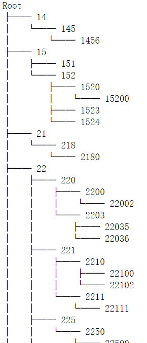
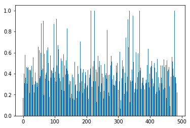

# 数据挖掘作业q3

作者：王星洲

学号：1652977

### 步骤一

```python
#省略读取数据，先进行数据准备
df = df.sort_values(by=["sldatime"])
time_series = df["sldatime"].drop_duplicates()
time_series = time_series.reset_index(drop=True)
print(time_series)
df = df.sort_values(by=["vipno"])
vipno_series = df["vipno"].drop_duplicates()
vipno_series = vipno_series.reset_index(drop=True)
print(vipno_series)
df = df.sort_values(by=["pluno"])
pluno_series = df["pluno"].drop_duplicates()
pluno_series = pluno_series.reset_index(drop=True)
print(pluno_series)
df1 = df1.sort_values(by=["pluno"])
pluno_series1 = df1["pluno"].drop_duplicates()
pluno_series1 = pluno_series1.reset_index(drop=True)
df2 = df2.sort_values(by=["pluno"])
pluno_series2 = df2["pluno"].drop_duplicates()
pluno_series2 = pluno_series2.reset_index(drop=True)
df3 = df3.sort_values(by=["pluno"])
pluno_series3 = df3["pluno"].drop_duplicates()
pluno_series3 = pluno_series3.reset_index(drop=True)
df4 = df4.sort_values(by=["pluno"])
pluno_series4 = df4["pluno"].drop_duplicates()
pluno_series4 = pluno_series4.reset_index(drop=True)
# 分组，求和
print(df)
group_data1 = df1.groupby(["vipno","sldatime","pluno"])["qty"].sum()
group_data1
group_data2 = df2.groupby(["vipno","sldatime","pluno"])["qty"].sum()
group_data2
group_data3 = df3.groupby(["vipno","sldatime","pluno"])["qty"].sum()
group_data3
group_data4 = df4.groupby(["vipno","sldatime","pluno"])["qty"].sum()
group_data4
group_data = df.groupby(["vipno","sldatime","pluno"])["qty"].sum()
print(group_data)
#记录：用户486个，plu一级18个，plu二级94个，plu三级329个，plu四级979个 购买时间最晚7月31日，最早2月1日

#评价时间和对应的显示层级
def judgeTimeLevel(a):
    delta = datetime.datetime(2016,7,31)-datetime.datetime(int(a[0:4]),int(a[5:7]),int(a[8:10]))
#     0全部显示
    if delta < datetime.timedelta(days=30):
        return 0
#     1显示到四级
    elif delta < datetime.timedelta(days=60):
        return 1
#     2显示到3级
    elif delta < datetime.timedelta(days=120):
        return 2
#     3显示到2级
    else:
        return 3
```

### 步骤二

```python
#为每一位用户搭建用户树
class Point1:
    def __init__(self, kind, qty):
        self.kind = kind
        self.qty = qty


tree_array = []
for i in vipno_series:
    tree = Tree()
    tree.create_node("Root","root")
    data = group_data[i]
    point_array = []
    for p,q in data.items():
        time = p[0]
        kind = p[1]
        kind1 = int(kind/1000000)
        kind2 = int(kind/100000)
        kind3 = int(kind/10000)
        kind4 = int(kind/1000)
        qty = q
        showLevel = judgeTimeLevel(time)
        print("time: " + str(time) + " level: " + str(showLevel))
        if showLevel == 0:
            if kind1 not in point_array:
                point_array.append(kind1)
                tree.create_node(kind1,kind1,parent="root",data=Point1(kind1,qty))
            else:
                tree.nodes[kind1].data.time = time
                tree.nodes[kind1].data.qty += qty
            if kind2 not in point_array:
                point_array.append(kind2)
                tree.create_node(kind2,kind2,parent=kind1,data=Point1(kind2,qty))
            else:
                tree.nodes[kind2].data.time = time
                tree.nodes[kind2].data.qty += qty
            if kind3 not in point_array:
                point_array.append(kind3)
                tree.create_node(kind3,kind3,parent=kind2,data=Point1(kind3,qty))
            else:
                tree.nodes[kind3].data.time = time
                tree.nodes[kind3].data.qty += qty
            if kind4 not in point_array:
                point_array.append(kind4)
                tree.create_node(kind4,kind4,parent=kind3,data=Point1(kind4,qty))
            else:
                tree.nodes[kind4].data.time = time
                tree.nodes[kind4].data.qty += qty
            if kind not in point_array:
                point_array.append(kind)
                tree.create_node(kind,kind,parent=kind4,data=Point1(kind,qty))
            else:
                tree.nodes[kind].data.time = time
                tree.nodes[kind].data.qty += qty
        elif showLevel == 1:
            if kind1 not in point_array:
                point_array.append(kind1)
                tree.create_node(kind1,kind1,parent="root",data=Point1(kind1,qty))
            else:
                tree.nodes[kind1].data.time = time
                tree.nodes[kind1].data.qty += qty
            if kind2 not in point_array:
                point_array.append(kind2)
                tree.create_node(kind2,kind2,parent=kind1,data=Point1(kind2,qty))
            else:
                tree.nodes[kind2].data.time = time
                tree.nodes[kind2].data.qty += qty
            if kind3 not in point_array:
                point_array.append(kind3)
                tree.create_node(kind3,kind3,parent=kind2,data=Point1(kind3,qty))
            else:
                tree.nodes[kind3].data.time = time
                tree.nodes[kind3].data.qty += qty
            if kind4 not in point_array:
                point_array.append(kind4)
                tree.create_node(kind4,kind4,parent=kind3,data=Point1(kind4,qty))
            else:
                tree.nodes[kind4].data.time = time
                tree.nodes[kind4].data.qty += qty
        elif showLevel == 2:
            if kind1 not in point_array:
                point_array.append(kind1)
                tree.create_node(kind1,kind1,parent="root",data=Point1(kind1,qty))
            else:
                tree.nodes[kind1].data.time = time
                tree.nodes[kind1].data.qty += qty
            if kind2 not in point_array:
                point_array.append(kind2)
                tree.create_node(kind2,kind2,parent=kind1,data=Point1(kind2,qty))
            else:
                tree.nodes[kind2].data.time = time
                tree.nodes[kind2].data.qty += qty
            if kind3 not in point_array:
                point_array.append(kind3)
                tree.create_node(kind3,kind3,parent=kind2,data=Point1(kind3,qty))
            else:
                tree.nodes[kind3].data.time = time
                tree.nodes[kind3].data.qty += qty
        elif showLevel == 3:
            if kind1 not in point_array:
                point_array.append(kind1)
                tree.create_node(kind1,kind1,parent="root",data=Point1(kind1,qty))
            else:
                tree.nodes[kind1].data.time = time
                tree.nodes[kind1].data.qty += qty
            if kind2 not in point_array:
                point_array.append(kind2)
                tree.create_node(kind2,kind2,parent=kind1,data=Point1(kind2,qty))
            else:
                tree.nodes[kind2].data.time = time
                tree.nodes[kind2].data.qty += qty
    tree_array.append(tree)
    tree.show()
```

运行结果：




### 步骤三

```python
#接下来是实现树之间的距离计算
def IR(tree1, tree2):
    result = Tree()
    result.create_node("Root","root")
    for i in tree1.nodes:
        for j in tree2.nodes:
            if i==j and i!="root":
                result.create_node(i,i,parent=tree1.nodes[i].predecessor(tree1.identifier),data=Point1(i,tree1.nodes[i].data.qty + tree2.nodes[i].data.qty))
    return result


def UR(tree1, tree2):
    result = Tree()
    result.create_node("Root","root")
    i_cluster = []
    ii_cluster = []
    jj_cluster = []
    for i in tree1.nodes:
        if i != "root":
            ii_cluster.append(i)
    for j in tree2.nodes:
        if j != "root":
            if j in ii_cluster:
                i_cluster.append(j)
                ii_cluster.remove(j)
            else:
                jj_cluster.append(j)
    for i in i_cluster:
        result.create_node(i,i,parent=tree1.nodes[i].predecessor(tree1.identifier),data=Point1(i,tree1.nodes[i].data.qty + tree2.nodes[i].data.qty))
    for i in ii_cluster:
            result.create_node(i,i,parent=tree1.nodes[i].predecessor(tree1.identifier),data=Point1(i,tree1.nodes[i].data.qty))
    for i in jj_cluster:
            result.create_node(i,i,parent=tree2.nodes[i].predecessor(tree2.identifier),data=Point1(i,tree2.nodes[i].data.qty))  
    return result


def FTC_dist(tree1, tree2):
    i_tree = IR(tree1, tree2)
#     i_tree.show()
    u_tree = UR(tree1, tree2)
#     u_tree.show()
    v1 = 0
    n1 = 0
    v2 = 0
    n2 = 0
    v3 = 0
    n3 = 0
    v4 = 0
    n4 = 0
    v5 = 0
    n5 = 0
    div_root = 0
    for i in u_tree.nodes["root"].successors(u_tree.identifier):
        div_root += u_tree.nodes[i].data.qty
    for i in i_tree.nodes:
        if i != "root":
            dep = len(str(i)) - 1
#             print("i: " + str(i) + "dep: " + str(dep))
            if dep == 1:
                div = div_root
#                 print("div: " + str(div))
                if div != 0:
                    v1 += i_tree.nodes[i].data.qty / div
#                     print("qty: " + str(i_tree.nodes[i].data.qty) + "v1_now: " + str(v1))
                else:
                    v1 = 0
                n1 += 1 
#                 print("n1_now: " + str(n1))
            elif dep == 2:
                div = 0
                for j in u_tree.get_node(u_tree.nodes[i].predecessor(u_tree.identifier)).successors(u_tree.identifier):
                    div += u_tree.nodes[j].data.qty
#                 print("div: " + str(div))
                if div != 0:
                    v2 += i_tree.nodes[i].data.qty / div
#                     print("qty: " + str(i_tree.nodes[i].data.qty) + "v2_now: " + str(v2))
                else:
                    v2 = 0
                n2 += 1
#                 print("n2_now: " + str(n2))
            elif dep == 3:
                div = 0
                for j in u_tree.get_node(u_tree.nodes[i].predecessor(u_tree.identifier)).successors(u_tree.identifier):
                    div += u_tree.nodes[j].data.qty
#                 print("div: " + str(div))
                if div != 0:
                    v3 += i_tree.nodes[i].data.qty / div
#                     print("qty: " + str(i_tree.nodes[i].data.qty) + "v3_now: " + str(v3))
                else:
                    v3 = 0
                n3 += 1
#                 print("n3_now: " + str(n3))
            elif dep == 4:
                div = 0
                for j in u_tree.get_node(u_tree.nodes[i].predecessor(u_tree.identifier)).successors(u_tree.identifier):
                    div += u_tree.nodes[j].data.qty
#                 print("div: " + str(div))
                if div != 0:
                    v4 += i_tree.nodes[i].data.qty / div
#                     print("qty: " + str(i_tree.nodes[i].data.qty) + "v4_now: " + str(v4))
                else:
                    v4 = 0
                n4 += 1
#                 print("n4_now: " + str(n4))
            else:
                div = 0
                for j in u_tree.get_node(u_tree.nodes[i].predecessor(u_tree.identifier)).successors(u_tree.identifier):
                    div += u_tree.nodes[j].data.qty
#                 print("div: " + str(div))
                if div != 0:
                    v5 += i_tree.nodes[i].data.qty / div
#                     print("qty: " + str(i_tree.nodes[i].data.qty) + "v5_now: " + str(v5))
                else:
                    v5 = 0
                n5 += 1
#                 print("n5_now: " + str(n5))
#     print("v1: " + str(v1))
#     print("v2: " + str(v2))
#     print("v3: " + str(v3))
#     print("v4: " + str(v4))
#     print("v5: " + str(v5))
#     print("n1: " + str(n1))
#     print("n2: " + str(n2))
#     print("n3: " + str(n3))
#     print("n4: " + str(n4))
#     print("n5: " + str(n5))
    if n1 != 0:
        sim1 = v1/n1
#         print(sim1)
    else:
        sim1 = 0
    if n2 != 0:
        sim2 = v2/n2
#         print(sim2)
    else:
        sim2 = 0
    if n3 != 0:
        sim3 = v3/n3
#         print(sim3)
    else:
        sim3 = 0
    if n4 != 0:
        sim4 = v4/n4
#         print(sim4)
    else:
        sim4 = 0
    if n5 != 0:
        sim5 = v5/n5
#         print(sim5)
    else:
        sim5 = 0
    if sim2 == 0:
        result = 1 - sim1
    elif sim3 == 0:
        result = 1 - (sim1/3 + sim2*2/3)
    elif sim4 == 0:
        result = 1 - (sim1/6 + sim2*2/6 + sim3*3/6)
    elif sim5 == 0:
        result = 1 - (sim1/10 + sim2*2/10 + sim3*3/10 + sim4*4/10)
    else:
        result = 1 - (sim1/15 + sim2*2/15 + sim3*3/15 + sim4*4/15 + sim5*5/15)
    return result


#测试
tree1 = Tree()
tree2 = Tree()
tree1.create_node("Root","root")
tree2.create_node("Root","root")
tree1.create_node(10,10,parent="root",data=Point1(10, 2))
tree1.create_node(101,101,parent=10,data=Point1(101, 2))
tree1.create_node(1012,1012,parent=101,data=Point1(1012, 2))
tree1.create_node(10128,10128,parent=1012,data=Point1(10128, 1))
tree1.create_node(10129,10129,parent=1012,data=Point1(10129, 1))
tree1.create_node(12,12,parent="root",data=Point1(12, 1))
tree1.create_node(122,122,parent=12,data=Point1(122, 1))
tree2.create_node(10,10,parent="root",data=Point1(10, 2))
tree2.create_node(101,101,parent=10,data=Point1(101, 2))
tree2.create_node(1012,1012,parent=101,data=Point1(1012, 1))
tree2.create_node(10128,10128,parent=1012,data=Point1(10128, 1))
tree2.create_node(1013,1013,parent=101,data=Point1(1013, 1))
tree2.create_node(13,13,parent="root",data=Point1(13, 1))
test_tree_array = [tree1, tree2]
FTC_dist(tree1,tree2)
```

运行结果：

```
0.2416666666666667
```

### 步骤四

```python
#实现质心算法
def UTREE(tree_array):
    print("正在合并大并集树")
    utree = tree_array[0]
    for i in range(len(tree_array) - 1):
        utree = UR(utree, tree_array[i+1])
    print("合并完成")
#     utree.show()
    return utree


def updateTree(tree, freq):
    flag = []
    for i in tree.nodes:
        if i != "root":
            if tree.nodes[i].data.qty < freq:
                flag.append(i)
    for i in flag:
        if tree.get_node(i):
            tree.remove_node(i)
    return tree


def GetCT(tree_array):
    print("正在计算树的质心")
    ct = Tree()
    utree = UTREE(tree_array)
    max_freq = 0
    sum_freq = 0
    freq = 1
    mindist = 999999
    num_avg_nodes = 0
    for q in tree_array:
        num_avg_nodes += len(q.all_nodes())
    num_avg_nodes /= len(tree_array)
    for i in utree.nodes:
        if i != "root":
            dep = len(str(i)) - 1
            if dep == 1:
                if utree.nodes[i].data.qty > max_freq:
                    max_freq = utree.nodes[i].data.qty
            sum_freq += utree.nodes[i].data.qty
    avg_freq = sum_freq / (len(utree.nodes) - 1)
    while freq <= max_freq:
        utree = updateTree(utree, freq)
        if len(utree.all_nodes()) <= num_avg_nodes:
            break
        dist = 0
        for i in tree_array:
            dist += FTC_dist(i,utree)
        if dist < mindist:
            mindist = dist
            ct = utree
        freq = freq + avg_freq
    print("计算完成")
    return ct
```

### 步骤五

```python
#设计针对FTC树的Kmeans算法
def initCentroids(dataSet, k):#dataSet-数据点数组 k-设置的质心数
    #初始化质心 
    print("正在选择随机质心")
    centroids = []
    index = random.sample(range(0, len(dataSet)), k)#index-在零到数据点个数间的随机数
    print(index)
    for i in range(len(index)):
        centroids.append(dataSet[index[i]])
        #将随机质心存储入centroids
    print("选择完成")
    return centroids


def kmeans(dataSet, k):
    #k-means算法的核心函数
    numSamples = len(dataSet)#数据点个数为数据点数组的行数
    label = np.zeros(numSamples)
    clusterChanged = True#clusterChanged-表示是否需要重新分组的布尔值判定量
    
    centroids = initCentroids(dataSet, k)#初始化质心
    step = 0
#     print(centroids)
    while clusterChanged:#需要重新分组时
        clusterChanged = False#重置判定量为假
        for i in range(numSamples):#遍历所有数据点
            minDist = 100000.0#minDist-最小的数据点与质心的距离
            minIndex = 0#minIndex-最小的链接地址
            for j in range(k):
                #计算每个数据点到哪个质心的距离最小，及记录是哪一个质心
                distance = FTC_dist(centroids[j], dataSet[i])#distance-暂时存放数据点到质心的距离，这里是FTC距离
                if distance < minDist:
                    minDist = distance
                    minIndex = j
            if label[i] != minIndex:#当该数据点所隶属的质心与最小链接地址不同时更新点中的数据
                clusterChanged = True#重置判定量为真
                label[i] = minIndex
        print(label)
#         print(label)
        for j in range(k):#由新的隶属关系中更新质心位置
            pointsInCluster = []
            for m in range(numSamples):
                if label[m] == j:
                    pointsInCluster.append(dataSet[m])
#                 print("m: " + str(m) + " label[m]: " + str(label[m]))                   
#             print(pointsInCluster)
            centroids[j] = GetCT(pointsInCluster)
#         print(centroids)
        step += 1
        if step >= 40:
            break
    print("分类完成")
    tree_array_array = []
    for i in range(k):
        tree_array = []
        for j in range(numSamples):
            if label[j] == i:
                tree_array.append(dataSet[j])
        tree_array_array.append(tree_array)
    return tree_array_array            
```

### 步骤六

```python
# 设计BIC算法
# Ni该簇用户数，k簇数量，ct质心树，C该簇树列表
def variance(Ni,ct,k,C):
    print("正在计算方差")
    result = 1/(Ni-k)
    sum_dist = 0
    for i in C:
        sum_dist += math.pow(FTC_dist(i,ct),2)
    result *= sum_dist
    print("variance: " + str(result))
    return result    


# N用户数，k簇数，D该簇商品数，ct质心，C该簇树列表
def L(N,D,C,ct,k):
    print("正在计算L")
    sum_num = 0
    for i in range(k):
        sum_num += N[i] * math.log(N[i])- N[i]*math.log(sum(N)) - N[i]/2*math.log(2*math.pi) - N[i]*D/2* math.log(variance(N[i],ct[i],k,C)) - (N[i] - k)/2
    result = sum_num 
    print("计算完成")
    return result


def BIC(C, array):
    print("BIC启动")
    #k=1
    N = [len(C)]
    D = len(UTREE(C).leaves())
    ct = [GetCT(C)]
    ct[0].show()
    l = L(N,D,C,ct,1)
    sub = 1/2*(D+1)*math.log(1)
    print("N: " + str(N) + " D: " + str(D) + " l: " + str(l) + " sub: " + str(sub))
    result1 = l - sub
    print("result1: " + str(result1))
    # k=2
    tree_array_array = kmeans(C, 2)
    tree_array1 = tree_array_array[0]
    tree_array2 = tree_array_array[1]
    N1 = [len(tree_array1),len(tree_array2)]
    ct = [GetCT(tree_array1),GetCT(tree_array2)]
    l1 = L(N1,D,C,ct,2)
    sub1 = (D+1)*math.log(2)
    result2 = l1 - sub1
    print("result1: " + str(result1))
    print("result2: " + str(result2))
    if result2 <= result1:
        print("无需分组")
        array.append(C)
    else:
        BIC(tree_array1, array)
        BIC(tree_array2, array)
        
        
result_array = []
a = kmeans(tree_array, 2)
for i in a:
    BIC(i, result_array)
k = len(result_array)
k
```

```python
#out
2
```

### 步骤七

```python
#设计聚类效果的评价函数
def getSC(tree_array, result_array):
    sum_number = 0
    for i in range(len(tree_array)):
        ai = 0
        bi = 0
        anum = 0
        bnum = 0
        for j in range(len(tree_array)):
            flag = False
            for m in range(len(result_array)):
                if tree_array[i] in result_array[m] and tree_array[j] in result_array[m]:
                    ai += FTC_dist(tree_array[i], tree_array[j])
                    anum += 1
                    flag = True
                    break
            if flag == False:
                bi += FTC_dist(tree_array[i], tree_array[j])
                bnum += 1
        ai = ai / anum
        bi = bi / bnum
        sum_number += (bi - ai) / max(ai, bi)
    return sum_number / len(tree_array)


def getCP(tree_array, result_array):
    k = len(result_array)
    cpnum = 0
    for i in result_array:
        distance = 0
        ct = GetCT(i)
        num = 0
        for j in range(len(tree_array)):
            if tree_array[j] in i:
                distance += FTC_dist(tree_array[j], ct)
                num += 1
        cpnum += distance/num
    return cpnum/k


sc = getSC(tree_array, result_array)
cp = getCP(tree_array, result_array)
print(sc)
print(cp)
```

运行结果：

```
sc:0.03001777457340002
cp:0.28558352013812394
```

### 结论

​	使用FTC树进行分析，在计算用户之间距离的时候有一个非常好的参照，这样计算出来的距离很有道理并且数据也很好，接下来我同样展示一下距离分布：

```python
distance = []
for i in range(len(tree_array)):
    distance.append(FTC_dist(tree_array[0], tree_array[i]))
plt.bar(range(len(tree_array)), distance)
```



可以看到，数据分布很合理，很完美，这样的用户间距离对聚类分析是很不错的。

但是我们的算法仍然出现了问题，我来总结一下算法分析出的结论:

```python
#以k=2为初始，利用kmeans方法分出的两个簇分别进行BIC运算，再对可以继续分的簇进行递归运算
#结果是：
k = 2
sc = 0.03001777457340002
cp = 0.28558352013812394
```

也就是说，除了开始时的主动使用kmeans分为两类以外，BIC公式的结果是不再进行分类，这还是很出乎我的意料的，因为如果利用这个距离分布，使用kmeans算法，最后的SC指标不会这么低，也不会只分为两类，那么问题出在哪里呢？

这里我找到了两个可能的原因：

1. 获取质心算法时，我在结点数小于平均结点数时跳出了循环，避免了最后全部结点消失，但是也带来了问题，就是最后有多个结点，不满足只剩下一个结点

   ```python
   num_avg_nodes = 0
   for q in tree_array:
   	num_avg_nodes += len(q.all_nodes())
   num_avg_nodes /= len(tree_array)
   if len(utree.all_nodes()) <= num_avg_nodes:
   	break
   ```

   这样就导致了质心选取不准确，同样的数据，质心也可能出现偏差，所以会导致数据出错。

2. 由于上述的原因，kmeans算法同样变得不稳定，导致迟迟不会收敛，因为质心跳跃式改变，每次都会有点的归属发生变化。我不得不进行强制手动收敛：

   ```python
   step = 0
   for j in range(k):
   	step += 1
   if step >= 40:
       break
   ```

   由于kmeans算法最后没有自动收敛，可能导致分类效果不好，BIC因此给出了不分类的判断。

总体来说，FTC树提供了一个测量用户间距离的很好的方式，这样即便直接使用FTC与kmeans结合，也可以得到很好的聚类效果。而将FTC与BIC结合进行聚类划分提供了一个不需要手动设置k值的，基于距离的优秀的聚类方式，不再依赖于k值的设定，唯一的缺点可能就是仍然受到初始质心选择的影响，但这也是kmeans算法逃不开的。

​	如果我使用一个其他的数据或者能够在选取质心的时候想到一个不会剪掉所有结点，又能稳定剩下一个结点的方式的话，可能效果会非常好。同样的，在选择初始质心的时候采用非随机，而是尽量较远的范围选点，效果可能会非常不错。

