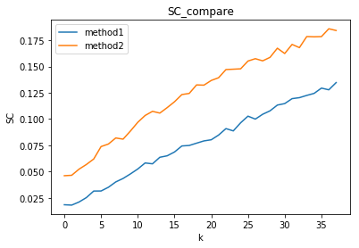
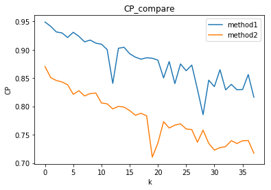

# 数据挖掘作业q4

作者：王星洲

学号：1652977

### 步骤一

```python
#由于方法三只有唯一值，不依赖于k的选取，所以我把方法一和方法二的SC\CP结果拿来作比较
array1 = [(0.01833235049925799, 0.9488639667901324), (0.01798931573043937, 0.9412414702059895), (0.02094337519143109, 0.9313847648592024), (0.02514653566404093, 0.9296559790380703), (0.031391170578805666, 0.9215624653625035), (0.0314417911421359, 0.9307869155167605), (0.03499876409962116, 0.9235706692524293), (0.04007431022388544, 0.9139491836554234), (0.0433962953240581, 0.9169783971115371), (0.04773129257490006, 0.9116483079744434), (0.05241878694777956, 0.9096732677005995), (0.05815230793189491, 0.9003977309682809), (0.05733159381634656, 0.840543030563803), (0.06357454202819898, 0.9025543811912513), (0.06498213632038577, 0.9043282788858121), (0.06861539695812925, 0.8928800676546692), (0.07435441259346143, 0.8868902640464662), (0.07481460125223427, 0.8833308993874629), (0.07701219806145809, 0.8858541038566077), (0.07915981331708787, 0.884936297748823), (0.08024824775137396, 0.8815238983617127), (0.08474550111956175, 0.8502468654323445), (0.09089251114422497, 0.8791706866017154), (0.08870752888989072, 0.8402152339127408), (0.09643438565486688, 0.8749197592537699), (0.10275254493248798, 0.862935239825473), (0.09994069570930138, 0.8729123637574928), (0.10455924600545538, 0.83018415589739), (0.10782668835971844, 0.7853585988310193), (0.11331040507705015, 0.8462749681100166), (0.11473061855499292, 0.834874583264884), (0.11943409481128404, 0.8647040582216089), (0.12037415102280426, 0.829127134147664), (0.12252200299747812, 0.8388242216471395), (0.12444788220575075, 0.8293156030946256), (0.1294886794123134, 0.8296866688479446), (0.12785095349306985, 0.8562056554356247), (0.1347510584296725, 0.8161889198783421), (0.13618654279521572, 0.8463994744646819), (0.14100397007479637, 0.7592215594594506), (0.1451168719988695, 0.817114397629069), (0.14512165808620575, 0.8104843775262333), (0.14821632595646872, 0.8374052742622954), (0.15058478166267594, 0.819678218320547), (0.15214947812394544, 0.8100759597929137), (0.1521399570261097, 0.8105386693875134), (0.1582282615282464, 0.7615221769051979), (0.1604202891667947, 0.8045381727784442), (0.16238979409226034, 0.7638493320292986)]
array2 = [(0.046009060242664455, 0.8703314634660553), (0.04639800140986168, 0.8507745782471007), (0.05223778588281045, 0.8456376368168257), (0.0566935590430981, 0.8431493097538644), (0.06192274837863743, 0.8381479902059875), (0.07376180474905145, 0.8213263839704223), (0.07619498835114803, 0.8275969889541755), (0.08196899003053335, 0.8183985455356022), (0.08084097548653246, 0.8227424299647964), (0.08860153147888537, 0.823448835207196), (0.09692827131098074, 0.8059556649567884), (0.10340349963964743, 0.804504663043267), (0.10734198666238734, 0.795502089742313), (0.10567994045519696, 0.8000799221307303), (0.11088282728752352, 0.7987122184817311), (0.11648661299222518, 0.7925162285447176), (0.12333206200997812, 0.7843122079991169), (0.12441300679296502, 0.7877305175020182), (0.13252647848121082, 0.7833612522715192), (0.13229130338814887, 0.7103942757034106), (0.13677147198394154, 0.7354396374295498), (0.13937959430553268, 0.7729682405904812), (0.14715264498363456, 0.7618160925415621), (0.147492899268557, 0.7668674654821456), (0.14784667225537074, 0.7691730476012262), (0.1552782580506372, 0.7601830177832005), (0.15751860731467987, 0.7589987317722463), (0.15546415700476252, 0.7367407975129647), (0.15877971943254068, 0.7579979619890335), (0.16751464692397214, 0.7347685734583977), (0.16244209603561277, 0.7228220673242257), (0.1711096423479383, 0.7272031881809556), (0.16806317873181773, 0.7289864361421701), (0.17860849824890354, 0.7394203609998274), (0.1783595849139852, 0.7344277601077048), (0.1785540606823688, 0.7393803836497161), (0.18602698564752815, 0.7397692607809426), (0.1843704923390654, 0.7173760381444888)]
```

### 步骤二

```python
sc_list1 = [x for x,_ in array1]
sc_list2 = [x for x,_ in array2]
sc_list1 = sc_list1[0:38]
plt.xlabel('k')
plt.ylabel('SC')
plt.title('SC_compare')
plt.plot(sc_list1, label='method1')
plt.plot(sc_list2, label='method2')
plt.legend()


cp_list1 = []
for i in range(len(array1[0:38])):
    cp_list1.append(array1[i][1])
cp_list2 = []
for i in range(len(array2)):
    cp_list2.append(array2[i][1])
plt.xlabel('k')
plt.ylabel('CP')
plt.title('CP_compare')
plt.plot(cp_list1, label='method1')
plt.plot(cp_list2, label='method2')
plt.legend()
```

运行结果：





### 结论

​	首先，从图上能明显看出，方法二比方法一SC普遍高，CP普遍低，说明效果更好，也就是说方法二的距离取法要比方法一优秀。

​	而方法三SC = 0.03001777457340002， CP = 0.28558352013812394 k = 2

我们反观k=2时

方法一： SC = 0.018332， CP = 0.948864

方法二： SC = 0.046009， CP = 0.870331

可以看出，虽然SC方法三比方法二略低，但是CP值非常好，也就是说每一个簇中的点更加密集，但是可以与其他簇距离并不是很远，这也是由于方法三取得的距离所决定的，因为方法三的距离普遍比方法一和方法二更低，但相对的，方法三获得的距离更加有理有据，也更加趋向于“理想”的距离。

方法三不再依赖于k值的设定，但是三者都是基于距离，且都利用了kmeans算法，因此初始质心的选择对他们都有很大影响。但同样是依赖距离，由于方法三的距离表示更加科学，所以得出的结果也更值得期待。