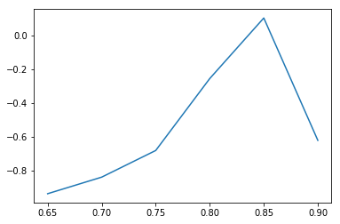
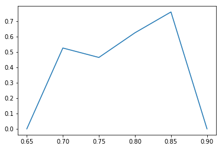

# 数据挖掘作业q5

作者：王星洲

学号：1652977


这次实验我使用了DBSCAN的方式，探讨基于密度的聚类能否解决这个问题。

### 步骤一

```python
# 读入数据所序列
df = pd.read_csv("../trade_new.csv", usecols=["vipno", "pluno", "amt"])
# 把pluno列取为第四级商品编号
df["pluno"] = (df["pluno"]/1000).astype(int)
# 分组，求和
df = df.groupby(["vipno","pluno"]).sum()
```

### 步骤二

```python
def jaccard_dist(a, b):
    fenzi = 0
    fenmu = 0
    for i in range(a.size):
        fenzi += min(a[i],b[i])
        fenmu += max(a[i],b[i])
    return 1-(fenzi/fenmu)
```

### 步骤三

```python
# visitlist类用于记录访问列表
# unvisitedlist记录未访问过的点
# visitedlist记录已访问过的点
# unvisitednum记录访问过的点数量
class visitlist:
    def __init__(self, count=0):
        self.unvisitedlist=[i for i in range(count)]
        self.visitedlist=list()
        self.unvisitednum=count

    def visit(self, pointId):
        self.visitedlist.append(pointId)
        self.unvisitedlist.remove(pointId)
        self.unvisitednum -= 1


def my_dbscanl(dataSet, eps, minPts):
    # numpy.ndarray的 shape属性表示矩阵的行数与列数
    nPoints = dataSet.shape[0]
    # (1)标记所有对象为unvisited
    # 在这里用一个类vPoints进行买现
    vPoints = visitlist(count=nPoints)
    # 初始化簇标记列表C,簇标记为 k
    k = -1
    C = [-1 for i in range(nPoints)]
    while(vPoints.unvisitednum > 0):
        # (3)随机上选择一个unvisited对象p
        p = random.choice(vPoints.unvisitedlist)
        # (4)标记p为visited
        vPoints.visit(p)
        # (5)if p的$\varepsilon$-邻域至少有MinPts个对象
        # N是p的$\varepsilon$-邻域点列表
        N = [i for i in range(nPoints) if jaccard_dist(dataSet.values[i,:], dataSet.values[p,:])<= eps]
#         print(len(N))
        if  len(N) >= minPts:
            # (6)创建个新簇C，并把p添加到C
            # 这里的C是一个标记列表，直接对第p个结点进行赋植
            k += 1
            C[p]=k
            # (7)令N为p的ε-邻域中的对象的集合
            # N是p的$\varepsilon$-邻域点集合
            # (8) for N中的每个点p'
            for p1 in N:
                # (9) if p'是unvisited
                if p1 in vPoints.unvisitedlist:
                    # (10)标记p’为visited
                    vPoints.visit(p1)
                    # (11) if p'的$\varepsilon$-邻域至少有MinPts个点，把这些点添加到N
                    # 找出p'的$\varepsilon$-邻域点，并将这些点去重添加到N
                    M=[i for i in range(nPoints) if jaccard_dist(dataSet.values[i,:], \
                        dataSet.values[p1,:]) <= eps]
                    if len(M) >= minPts:
                        for i in M:
                            if i not in N:
                                N.append(i)
                    # (12) if p'还不是任何簇的成员，把P'添加到C
                    # C是标记列表，直接把p'分到对应的簇里即可
                    if  C[p1] == -1:
                        C[p1]= k
        # (15)else标记p为噪声
        else:
            C[p]=-1

    # (16)until没有标t己为unvisitedl内对象
    return C


def getCentroid(dataSet):
    div = len(dataSet)
    return sum(dataSet)/div


def CP(label, dataSet):
    centroids = []
    k = max(label) + 1
    if k > 1:
        print(k)
        for i in range(1, k):
            data = []
            for j in range(len(label)):
                if label[j] == i:
                    data.append(dataSet.values[j,:])
            centroids.append(getCentroid(data))
        cpnum = 0
        for i in range(1, k):
            distance = 0
            num = 0
            for j in range(len(label)):
                if label[j] == i:
                    distance += jaccard_dist(dataSet.values[j,:],centroids[i - 1])
                    num += 1
            cpnum += distance/num
        return cpnum / (k - 1)
    else:
        return 0
    
    
def getSC(dataSet, label):
    sum_number = 0
    k = len(label)
    for i in range(k):
        ai = 0
        bi = 0
        anum = 0
        bnum = 0
        for j in range(k):
            if label[i]==label[j]:
                ai += jaccard_dist(dataSet.values[i,:],dataSet.values[j,:])
                anum += 1
            else:
                bi += jaccard_dist(dataSet.values[i,:],dataSet.values[j,:])
                bnum += 1
        if anum == 0:
            ai = 0
        else: 
            ai = ai / anum
        if bnum == 0:
            bi = 0
        else: 
            bi = bi / anum
        sum_number += (bi - ai) / max(ai, bi)     
    return sum_number / k


#数据准备
df = df.sort_values(by=["vipno"])
vipno_series = df["vipno"].drop_duplicates()
vipno_series = vipno_series.reset_index(drop=True)
print(vipno_series)
df = df.sort_values(by=["pluno"])
pluno_series = df["pluno"].drop_duplicates()
pluno_series = pluno_series.reset_index(drop=True)
print(pluno_series)
data = DataFrame(0, columns=pluno_series, index=vipno_series)
# print(data)
for i in df.index:
    vipno = df['vipno'][i]
    pluno = df['pluno'][i]
    amt = group_data[vipno][pluno]
    if math.isnan(data[pluno][vipno]):
        data[pluno][vipno] = amt
    else:
        data[pluno][vipno] += amt
print(data)


# 调节eps值
sc_cp_label = []
for i in np.arange(0.65, 0.9, 0.05):
    label = my_dbscanl(data, i, 5)
    print(label)
    sc = getSC(data, label)
    cp = CP(label, data)
    sc_cp_label.append((sc, cp))
```

运行结果：

|  eps |        SC |        1 |
| ---: | --------: | -------: |
| 0.65 | -0.938505 | 0.000000 |
| 0.70 | -0.840310 | 0.524794 |
| 0.75 | -0.682267 | 0.463483 |
| 0.80 | -0.255707 | 0.623508 |
| 0.85 |  0.103311 | 0.758701 |
| 0.90 | -0.622185 | 0.000000 |

SC趋势



CP趋势



### 结论

​	首先我们可以看出eps在0.85附近取得比较好的效果。

​	其次可以看出DBSCAN在解决这个问题时的效果也比较一般。分析原因的话：

1. 不确定的eps与minPoint。DBSCAN需要指定eps与minPoint两个参数，设定的是否合理会对结果产生很大的影响
2. 采取的data并没有经过精细的加工，使用了与方法一相同的data，这样的距离并不太可取，导致DBSCAN的半径必须很大，否则就无法进行聚类，这样就会导致效果变差。采用FTC_Tree可能会很好的解决这个问题。
3. DBSCAN的核心是基于密度，顾客购买的物品可能更趋向于散点分布，而没有紧密连在一起的情况，所以效果会不如基于距离的。