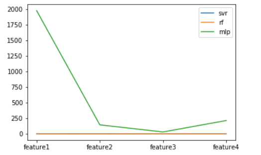
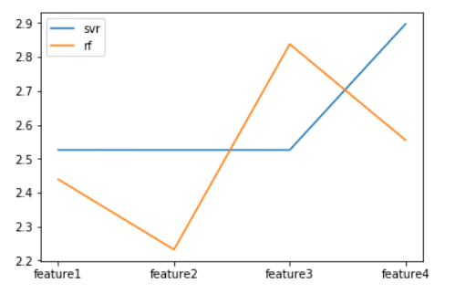

# q3报告

作者：王星洲

学号：1652977

### 步骤

1. 读取所需的数据，并处理成所需的四个特征

```python
df1 = pd.read_csv("../q2/feature1.csv", index_col=0)
df2 = pd.read_csv("../q2/feature2.csv", index_col=0)
df3 = pd.read_csv("../q2/feature3.csv", index_col=0)
df4 = pd.read_csv("../q2/feature4.csv", index_col=0)
df5 = pd.read_csv("../q2/feature5.csv", index_col=0)
df6 = pd.read_csv("../q2/feature6.csv", index_col=0)
feature1 = df1.copy(deep = True)
feature2 = pd.merge(df1, df4, on=["pluno","sldatime","qty"])
feature3 = pd.merge(df1, df2, on=["pluno","bndno","sldatime","qty"])
feature3 = pd.merge(feature3, df3, on=["pluno","kind1","kind2","kind3","kind4","bndno","sldatime","qty","isWeekday"])
feature3 = pd.merge(feature3, df4, on=["pluno","sldatime","qty"])
feature4 = pd.merge(feature3, df5, on=["pluno","sldatime","qty"])
feature4 = pd.merge(feature4, df6, on=["pluno","sldatime","qty"])
feature_qty = feature1.qty
feature1 = feature1.drop('qty',axis=1)
feature1.insert(0,'qty',feature_qty)
feature2 = feature2.drop('qty',axis=1)
feature2.insert(0,'qty',feature_qty)
feature3 = feature3.drop('qty',axis=1)
feature3.insert(0,'qty',feature_qty)
feature4 = feature4.drop('qty',axis=1)
feature4.insert(0,'qty',feature_qty)
feature4


# In[6]:


feature1 = feature1.sort_values(by="sldatime").reset_index(drop=True)
feature2 = feature2.sort_values(by="sldatime").reset_index(drop=True)
feature3 = feature3.sort_values(by="sldatime").reset_index(drop=True)
feature4 = feature4.sort_values(by="sldatime").reset_index(drop=True)
```

2. 将数据集整理为训练数据和测试数据

```python
x1 = feature1.iloc[:,1:].values
x2 = feature2.iloc[:,1:].values
x3 = feature3.iloc[:,1:].values
x4 = feature4.iloc[:,1:].values
y1 = feature1.iloc[:,0].values
y2 = feature2.iloc[:,0].values
y3 = feature3.iloc[:,0].values
y4 = feature4.iloc[:,0].values


# In[14]:


x_train1 = x1[0:int(114114*0.8)]
x_train2 = x2[0:int(114114*0.8)]
x_train3 = x3[0:int(114114*0.8)]
x_train4 = x4[0:int(114114*0.8)]


# In[15]:


# 舍弃前七天的数据
x_train1 = x_train1[8*627:]
# 舍弃28天数据
x_train2 = x_train2[29*627:]
x_train3 = x_train3[29*627:]
x_train4 = x_train4[29*627:]


# In[119]:


x_test1 = x1[int(114114*0.8):]
x_test2 = x2[int(114114*0.8):]
x_test3 = x3[int(114114*0.8):]
x_test4 = x4[int(114114*0.8):]
# 舍弃最后无法预估一星期数据的内容
x_test1 = x_test1[:-6*627]
x_test2 = x_test2[:-6*627]
x_test3 = x_test3[:-6*627]
x_test4 = x_test4[:-6*627]


# In[17]:


y_train1 = y1[0:int(114114*0.8)]
y_train1 = y_train1[8*627:]
y_test1 = y1[int(114114*0.8):]
y_train2 = y2[0:int(114114*0.8)]
y_train2 = y_train2[29*627:]
y_test2 = y2[int(114114*0.8):]
y_train3 = y3[0:int(114114*0.8)]
y_train3 = y_train3[29*627:]
y_test3 = y3[int(114114*0.8):]
y_train4 = y4[0:int(114114*0.8)]
y_train4 = y_train4[29*627:]
y_test4 = y4[int(114114*0.8):]
```

3. 分别用三种回归模型进行训练

```python
svr1 = SVR()
svr1.fit(x_train1, y_train1)
svr2 = SVR()
svr2.fit(x_train2, y_train2)
svr3 = SVR()
svr3.fit(x_train3, y_train3)
svr4 = SVR()
svr4.fit(x_train4, y_train4)


# In[157]:


rf1=RandomForestRegressor()
rf1.fit(x_train1, y_train1)
rf2=RandomForestRegressor()
rf2.fit(x_train2, y_train2)
rf3=RandomForestRegressor()
rf3.fit(x_train3, y_train3)
rf4=RandomForestRegressor()
rf4.fit(x_train4, y_train4)


# In[20]:


mlp1=MLPRegressor()
mlp1.fit(x_train1, y_train1)
mlp2=MLPRegressor()
mlp2.fit(x_train2, y_train2)
mlp3=MLPRegressor()
mlp3.fit(x_train3, y_train3)
mlp4=MLPRegressor()
mlp4.fit(x_train4, y_train4)
```

4. 计算RSE方法的分母平方

```python
# RSE分母平方
orgpowsum = 0
test_f1 = feature1.iloc[int(114114*0.8):]
qtyl1 = test_f1.qty.to_list()
qtymean1 = np.mean(qtyl1)
for i in range(qtyl1.__len__()):
    orgpowsum = orgpowsum + math.pow(qtyl1[i]-qtymean1,2)
```

5. 利用特征1进行分析，这里选择SVR方法展示

```python
# RSE分子平方
deltapowsum = 0
#对于每件商品
for j in range(x_test1.__len__()):
    print(j)
    # 这里把所需的数据生成一个新的dataframe,并且在每一步预估完成后将dataframe更新,作为第二天估计的新特征
    m = feature1.loc[feature1["pluno"]==x_test1[j][1]].reset_index(drop=True)
    true = m.iloc[int(x_test1[j][0]):int(x_test1[j][0]) + 7].loc[:,'qty'].to_list()
    m = m.iloc[int(x_test1[j][0])-7:int(x_test1[j][0]) + 1].reset_index(drop=True)
    for i in range(7,14):
        new_test = m.iloc[i,1:].values
        m.loc[i,'qty'] = svr1.predict([new_test])[0]
        m.loc[i + 1]=[0,x_test1[j][0] + i - 6,x_test1[j][1],x_test1[j][2],x_test1[j][3],x_test1[j][4],x_test1[j][5],x_test1[j][6],isWeekday(m.loc[i,'sldatime']+1),m.loc[i,'qty'],m.loc[i-1,'qty'],m.loc[i-2,'qty'],m.loc[i-3,'qty'],m.loc[i-4,'qty'],m.loc[i-5,'qty'],m.loc[i-6,'qty']]
    predict = m.loc[7:13,'qty'].to_list()
    for p in range(true.__len__()):
        deltapowsum = deltapowsum + math.pow(true[p]-predict[p],2)
# 计算RSE
rse_svr1 = math.sqrt(deltapowsum/orgpowsum)
rse_svr1
```

6. 同理利用feature2进行计算

```python
deltapowsum = 0
for j in range(x_test2.__len__()):
    print(j)
    m = feature2.loc[feature2["pluno"]==x_test2[j][1]].reset_index(drop=True)
    true = m.iloc[int(x_test2[j][0]):int(x_test2[j][0]) + 7].loc[:,'qty'].to_list()
    m = m.iloc[int(x_test2[j][0])-28:int(x_test2[j][0]) + 1].reset_index(drop=True)
    for i in range(28,35):
        new_test = m.iloc[i,1:].values
        m.loc[i,'qty'] = svr2.predict([new_test])[0]
        m.loc[i + 1]=[0,x_test2[j][0] + i - 27,x_test2[j][1],x_test2[j][2],x_test2[j][3],x_test2[j][4],x_test2[j][5],x_test2[j][6],isWeekday(m.loc[i,'sldatime']+1),m.loc[i,'qty'],m.loc[i-1,'qty'],m.loc[i-2,'qty'],m.loc[i-3,'qty'],m.loc[i-4,'qty'],m.loc[i-5,'qty'],m.loc[i-6,'qty'],np.mean(m.loc[i-13:i-7].qty),np.max(m.loc[i-13:i-7].qty),np.min(m.loc[i-13:i-7].qty),np.mean(m.loc[i-20:i-14].qty),np.max(m.loc[i-20:i-14].qty),np.min(m.loc[i-20:i-14].qty),np.mean(m.loc[i-27:i-21].qty),np.max(m.loc[i-27:i-21].qty),np.min(m.loc[i-27:i-21].qty)]
    predict = m.loc[28:34,'qty'].to_list()
    for p in range(true.__len__()):
        deltapowsum = deltapowsum + math.pow(true[p]-predict[p],2)
rse_svr2 = math.sqrt(deltapowsum/orgpowsum)
rse_svr2
```

7. 特征工程3计算,这里我将三个方法合在一起

```python
deltapowsum1 = 0
deltapowsum2 = 0
deltapowsum3 = 0
for j in range(x_test3.__len__()):
    print(j)
    m1 = feature3.loc[feature3["pluno"]==x_test3[j][1]].reset_index(drop=True)
    
    bn1 = feature3.loc[feature3["bndno"]==x_test3[j][2]].groupby(["bndno","sldatime"],as_index=False).sum().reset_index(drop=True).iloc[int(x_test3[j][0])-28:int(x_test3[j][0]) + 1].reset_index(drop=True)[["bndno","sldatime","qty"]]
    kn11 = feature3.loc[feature3["kind1"]==x_test3[j][3]].groupby(["kind1","sldatime"],as_index=False).sum().reset_index(drop=True).iloc[int(x_test3[j][0])-28:int(x_test3[j][0]) + 1].reset_index(drop=True)[["kind1","sldatime","qty"]]
    kn21 = feature3.loc[feature3["kind2"]==x_test3[j][4]].groupby(["kind1","sldatime"],as_index=False).sum().reset_index(drop=True).iloc[int(x_test3[j][0])-28:int(x_test3[j][0]) + 1].reset_index(drop=True)[["kind2","sldatime","qty"]]
    kn31 = feature3.loc[feature3["kind3"]==x_test3[j][5]].groupby(["kind1","sldatime"],as_index=False).sum().reset_index(drop=True).iloc[int(x_test3[j][0])-28:int(x_test3[j][0]) + 1].reset_index(drop=True)[["kind3","sldatime","qty"]]
    kn41 = feature3.loc[feature3["kind4"]==x_test3[j][6]].groupby(["kind1","sldatime"],as_index=False).sum().reset_index(drop=True).iloc[int(x_test3[j][0])-28:int(x_test3[j][0]) + 1].reset_index(drop=True)[["kind4","sldatime","qty"]]
    bn2 = bn1.copy(deep=True)
    kn12 = kn11.copy(deep=True)
    kn22 = kn21.copy(deep=True)
    kn32 = kn31.copy(deep=True)
    kn42 = kn41.copy(deep=True)
    bn3 = bn1.copy(deep=True)
    kn13 = kn11.copy(deep=True)
    kn23 = kn21.copy(deep=True)
    kn33 = kn31.copy(deep=True)
    kn43 = kn41.copy(deep=True)

    true = m1.iloc[int(x_test3[j][0]):int(x_test3[j][0]) + 7].loc[:,'qty'].to_list()
    m1 = m1.iloc[int(x_test3[j][0])-28:int(x_test3[j][0]) + 1].reset_index(drop=True)
    m2 = m1.copy(deep=True)
    m3 = m1.copy(deep=True)
    
    for i in range(28,35):
        new_test1 = m1.iloc[i,1:].values
        new_test2 = m2.iloc[i,1:].values
        new_test3 = m3.iloc[i,1:].values
        predict_num1 = svr3.predict([new_test1])[0]
        predict_num2 = rf3.predict([new_test2])[0]
        predict_num3 = mlp3.predict([new_test3])[0]
        m1.loc[i,'qty'] = predict_num1
        bn1.loc[i,'qty'] = predict_num1
        kn11.loc[i,'qty'] = predict_num1
        kn21.loc[i,'qty'] = predict_num1
        kn31.loc[i,'qty'] = predict_num1
        kn41.loc[i,'qty'] = predict_num1
        m2.loc[i,'qty'] = predict_num2
        bn2.loc[i,'qty'] = predict_num2
        kn12.loc[i,'qty'] = predict_num2
        kn22.loc[i,'qty'] = predict_num2
        kn32.loc[i,'qty'] = predict_num2
        kn42.loc[i,'qty'] = predict_num2
        m3.loc[i,'qty'] = predict_num3
        bn3.loc[i,'qty'] = predict_num3
        kn13.loc[i,'qty'] = predict_num3
        kn23.loc[i,'qty'] = predict_num3
        kn33.loc[i,'qty'] = predict_num3
        kn43.loc[i,'qty'] = predict_num3
        bn1.loc[i + 1] = [x_test3[j][2],x_test3[j][0] + i - 27,0]
        kn11.loc[i + 1] = [x_test3[j][3],x_test3[j][0] + i - 27,0]
        kn21.loc[i + 1] = [x_test3[j][4],x_test3[j][0] + i - 27,0]
        kn31.loc[i + 1] = [x_test3[j][5],x_test3[j][0] + i - 27,0]
        kn41.loc[i + 1] = [x_test3[j][6],x_test3[j][0] + i - 27,0]
        bn2.loc[i + 1] = [x_test3[j][2],x_test3[j][0] + i - 27,0]
        kn12.loc[i + 1] = [x_test3[j][3],x_test3[j][0] + i - 27,0]
        kn22.loc[i + 1] = [x_test3[j][4],x_test3[j][0] + i - 27,0]
        kn32.loc[i + 1] = [x_test3[j][5],x_test3[j][0] + i - 27,0]
        kn42.loc[i + 1] = [x_test3[j][6],x_test3[j][0] + i - 27,0]
        bn3.loc[i + 1] = [x_test3[j][2],x_test3[j][0] + i - 27,0]
        kn13.loc[i + 1] = [x_test3[j][3],x_test3[j][0] + i - 27,0]
        kn23.loc[i + 1] = [x_test3[j][4],x_test3[j][0] + i - 27,0]
        kn33.loc[i + 1] = [x_test3[j][5],x_test3[j][0] + i - 27,0]
        kn43.loc[i + 1] = [x_test3[j][6],x_test3[j][0] + i - 27,0]
        m1.loc[i + 1]=[0,x_test3[j][0] + i - 27,x_test3[j][1],x_test3[j][2],x_test3[j][3],x_test3[j][4],x_test3[j][5],x_test3[j][6],isWeekday(m.loc[i,'sldatime']+1),m1.loc[i,'qty'],m1.loc[i-1,'qty'],m1.loc[i-2,'qty'],m1.loc[i-3,'qty'],m1.loc[i-4,'qty'],m1.loc[i-5,'qty'],m1.loc[i-6,'qty'],bn1.loc[i,'qty'],bn1.loc[i-1,'qty'],bn1.loc[i-2,'qty'],bn1.loc[i-3,'qty'],bn1.loc[i-4,'qty'],bn1.loc[i-5,'qty'],bn1.loc[i-6,'qty'],kn11.loc[i,'qty'],kn11.loc[i-1,'qty'],kn11.loc[i-2,'qty'],kn11.loc[i-3,'qty'],kn11.loc[i-4,'qty'],kn11.loc[i-5,'qty'],kn11.loc[i-6,'qty'],kn21.loc[i,'qty'],kn21.loc[i-1,'qty'],kn21.loc[i-2,'qty'],kn21.loc[i-3,'qty'],kn21.loc[i-4,'qty'],kn21.loc[i-5,'qty'],kn21.loc[i-6,'qty'],kn31.loc[i,'qty'],kn31.loc[i-1,'qty'],kn31.loc[i-2,'qty'],kn31.loc[i-3,'qty'],kn31.loc[i-4,'qty'],kn31.loc[i-5,'qty'],kn31.loc[i-6,'qty'],kn41.loc[i,'qty'],kn41.loc[i-1,'qty'],kn41.loc[i-2,'qty'],kn41.loc[i-3,'qty'],kn41.loc[i-4,'qty'],kn41.loc[i-5,'qty'],kn41.loc[i-6,'qty'],np.mean(m1.loc[i-13:i-7].qty),np.max(m1.loc[i-13:i-7].qty),np.min(m1.loc[i-13:i-7].qty),np.mean(m1.loc[i-20:i-14].qty),np.max(m1.loc[i-20:i-14].qty),np.min(m1.loc[i-20:i-14].qty),np.mean(m1.loc[i-27:i-21].qty),np.max(m1.loc[i-27:i-21].qty),np.min(m1.loc[i-27:i-21].qty)]
        m2.loc[i + 1]=[0,x_test3[j][0] + i - 27,x_test3[j][1],x_test3[j][2],x_test3[j][3],x_test3[j][4],x_test3[j][5],x_test3[j][6],isWeekday(m.loc[i,'sldatime']+1),m2.loc[i,'qty'],m2.loc[i-1,'qty'],m2.loc[i-2,'qty'],m2.loc[i-3,'qty'],m2.loc[i-4,'qty'],m2.loc[i-5,'qty'],m2.loc[i-6,'qty'],bn2.loc[i,'qty'],bn2.loc[i-1,'qty'],bn2.loc[i-2,'qty'],bn2.loc[i-3,'qty'],bn2.loc[i-4,'qty'],bn2.loc[i-5,'qty'],bn2.loc[i-6,'qty'],kn12.loc[i,'qty'],kn12.loc[i-1,'qty'],kn12.loc[i-2,'qty'],kn12.loc[i-3,'qty'],kn12.loc[i-4,'qty'],kn12.loc[i-5,'qty'],kn12.loc[i-6,'qty'],kn22.loc[i,'qty'],kn22.loc[i-1,'qty'],kn22.loc[i-2,'qty'],kn22.loc[i-3,'qty'],kn22.loc[i-4,'qty'],kn22.loc[i-5,'qty'],kn22.loc[i-6,'qty'],kn32.loc[i,'qty'],kn32.loc[i-1,'qty'],kn32.loc[i-2,'qty'],kn32.loc[i-3,'qty'],kn32.loc[i-4,'qty'],kn32.loc[i-5,'qty'],kn32.loc[i-6,'qty'],kn42.loc[i,'qty'],kn42.loc[i-1,'qty'],kn42.loc[i-2,'qty'],kn42.loc[i-3,'qty'],kn42.loc[i-4,'qty'],kn42.loc[i-5,'qty'],kn42.loc[i-6,'qty'],np.mean(m2.loc[i-13:i-7].qty),np.max(m2.loc[i-13:i-7].qty),np.min(m2.loc[i-13:i-7].qty),np.mean(m2.loc[i-20:i-14].qty),np.max(m2.loc[i-20:i-14].qty),np.min(m2.loc[i-20:i-14].qty),np.mean(m2.loc[i-27:i-21].qty),np.max(m2.loc[i-27:i-21].qty),np.min(m2.loc[i-27:i-21].qty)]
        m3.loc[i + 1]=[0,x_test3[j][0] + i - 27,x_test3[j][1],x_test3[j][2],x_test3[j][3],x_test3[j][4],x_test3[j][5],x_test3[j][6],isWeekday(m.loc[i,'sldatime']+1),m3.loc[i,'qty'],m3.loc[i-1,'qty'],m3.loc[i-2,'qty'],m3.loc[i-3,'qty'],m3.loc[i-4,'qty'],m3.loc[i-5,'qty'],m3.loc[i-6,'qty'],bn3.loc[i,'qty'],bn3.loc[i-1,'qty'],bn3.loc[i-2,'qty'],bn3.loc[i-3,'qty'],bn3.loc[i-4,'qty'],bn3.loc[i-5,'qty'],bn3.loc[i-6,'qty'],kn13.loc[i,'qty'],kn13.loc[i-1,'qty'],kn13.loc[i-2,'qty'],kn13.loc[i-3,'qty'],kn13.loc[i-4,'qty'],kn13.loc[i-5,'qty'],kn13.loc[i-6,'qty'],kn23.loc[i,'qty'],kn23.loc[i-1,'qty'],kn23.loc[i-2,'qty'],kn23.loc[i-3,'qty'],kn23.loc[i-4,'qty'],kn23.loc[i-5,'qty'],kn23.loc[i-6,'qty'],kn33.loc[i,'qty'],kn33.loc[i-1,'qty'],kn33.loc[i-2,'qty'],kn33.loc[i-3,'qty'],kn33.loc[i-4,'qty'],kn33.loc[i-5,'qty'],kn33.loc[i-6,'qty'],kn43.loc[i,'qty'],kn43.loc[i-1,'qty'],kn43.loc[i-2,'qty'],kn43.loc[i-3,'qty'],kn43.loc[i-4,'qty'],kn43.loc[i-5,'qty'],kn43.loc[i-6,'qty'],np.mean(m3.loc[i-13:i-7].qty),np.max(m3.loc[i-13:i-7].qty),np.min(m3.loc[i-13:i-7].qty),np.mean(m3.loc[i-20:i-14].qty),np.max(m3.loc[i-20:i-14].qty),np.min(m3.loc[i-20:i-14].qty),np.mean(m3.loc[i-27:i-21].qty),np.max(m3.loc[i-27:i-21].qty),np.min(m3.loc[i-27:i-21].qty)]
    predict1 = m1.loc[28:34,'qty'].to_list()
    predict2 = m2.loc[28:34,'qty'].to_list()
    predict3 = m3.loc[28:34,'qty'].to_list()
    for p in range(true.__len__()):
        deltapowsum1 = deltapowsum1 + math.pow(true[p]-predict1[p],2)
        deltapowsum2 = deltapowsum2 + math.pow(true[p]-predict2[p],2)
        deltapowsum3 = deltapowsum3 + math.pow(true[p]-predict3[p],2)
rse_svr3 = math.sqrt(deltapowsum1/orgpowsum)
rse_rf3 = math.sqrt(deltapowsum2/orgpowsum)
rse_mlp3 = math.sqrt(deltapowsum3/orgpowsum)
```

8. 特征工程4计算,值得一提的是由于测试需要时间超出预期,所以我将训练数据缩减为原来的三分之一来进行计算,也就导致了更大的不稳定性

```python
deltapowsum1 = 0
deltapowsum2 = 0
deltapowsum3 = 0
for j in range(int(x_test4.__len__()/3)):
    print(j)
    m1 = feature4.loc[feature4["pluno"]==x_test4[j][1]].reset_index(drop=True)
    
    bn1 = feature4.loc[feature4["bndno"]==x_test4[j][2]].groupby(["bndno","sldatime"],as_index=False).sum().reset_index(drop=True).iloc[int(x_test4[j][0])-28:int(x_test4[j][0]) + 1].reset_index(drop=True)[["bndno","sldatime","qty"]]
    kn11 = feature4.loc[feature4["kind1"]==x_test4[j][3]].groupby(["kind1","sldatime"],as_index=False).sum().reset_index(drop=True).iloc[int(x_test4[j][0])-28:int(x_test4[j][0]) + 1].reset_index(drop=True)[["kind1","sldatime","qty"]]
    kn21 = feature4.loc[feature4["kind2"]==x_test4[j][4]].groupby(["kind1","sldatime"],as_index=False).sum().reset_index(drop=True).iloc[int(x_test4[j][0])-28:int(x_test4[j][0]) + 1].reset_index(drop=True)[["kind2","sldatime","qty"]]
    kn31 = feature4.loc[feature4["kind3"]==x_test4[j][5]].groupby(["kind1","sldatime"],as_index=False).sum().reset_index(drop=True).iloc[int(x_test4[j][0])-28:int(x_test4[j][0]) + 1].reset_index(drop=True)[["kind3","sldatime","qty"]]
    kn41 = feature4.loc[feature4["kind4"]==x_test4[j][6]].groupby(["kind1","sldatime"],as_index=False).sum().reset_index(drop=True).iloc[int(x_test4[j][0])-28:int(x_test4[j][0]) + 1].reset_index(drop=True)[["kind4","sldatime","qty"]]
    bn2 = bn1.copy(deep=True)
    kn12 = kn11.copy(deep=True)
    kn22 = kn21.copy(deep=True)
    kn32 = kn31.copy(deep=True)
    kn42 = kn41.copy(deep=True)
    bn3 = bn1.copy(deep=True)
    kn13 = kn11.copy(deep=True)
    kn23 = kn21.copy(deep=True)
    kn33 = kn31.copy(deep=True)
    kn43 = kn41.copy(deep=True)

    true = m1.iloc[int(x_test4[j][0]):int(x_test4[j][0]) + 7].loc[:,'qty'].to_list()
    m1 = m1.iloc[int(x_test4[j][0])-28:int(x_test4[j][0]) + 1].reset_index(drop=True)
    m2 = m1.copy(deep=True)
    m3 = m1.copy(deep=True)
    
    for i in range(28,35):
        new_test1 = m1.iloc[i,1:].values
        new_test2 = m2.iloc[i,1:].values
        new_test3 = m3.iloc[i,1:].values
        predict_num1 = svr4.predict([new_test1])[0]
        predict_num2 = rf4.predict([new_test2])[0]
        predict_num3 = mlp4.predict([new_test3])[0]
        m1.loc[i,'qty'] = predict_num1
        bn1.loc[i,'qty'] = predict_num1
        kn11.loc[i,'qty'] = predict_num1
        kn21.loc[i,'qty'] = predict_num1
        kn31.loc[i,'qty'] = predict_num1
        kn41.loc[i,'qty'] = predict_num1
        m2.loc[i,'qty'] = predict_num2
        bn2.loc[i,'qty'] = predict_num2
        kn12.loc[i,'qty'] = predict_num2
        kn22.loc[i,'qty'] = predict_num2
        kn32.loc[i,'qty'] = predict_num2
        kn42.loc[i,'qty'] = predict_num2
        m3.loc[i,'qty'] = predict_num3
        bn3.loc[i,'qty'] = predict_num3
        kn13.loc[i,'qty'] = predict_num3
        kn23.loc[i,'qty'] = predict_num3
        kn33.loc[i,'qty'] = predict_num3
        kn43.loc[i,'qty'] = predict_num3
        bn1.loc[i + 1] = [x_test4[j][2],x_test4[j][0] + i - 27,0]
        kn11.loc[i + 1] = [x_test4[j][3],x_test4[j][0] + i - 27,0]
        kn21.loc[i + 1] = [x_test4[j][4],x_test4[j][0] + i - 27,0]
        kn31.loc[i + 1] = [x_test4[j][5],x_test4[j][0] + i - 27,0]
        kn41.loc[i + 1] = [x_test4[j][6],x_test4[j][0] + i - 27,0]
        bn2.loc[i + 1] = [x_test4[j][2],x_test4[j][0] + i - 27,0]
        kn12.loc[i + 1] = [x_test4[j][3],x_test4[j][0] + i - 27,0]
        kn22.loc[i + 1] = [x_test4[j][4],x_test4[j][0] + i - 27,0]
        kn32.loc[i + 1] = [x_test4[j][5],x_test4[j][0] + i - 27,0]
        kn42.loc[i + 1] = [x_test4[j][6],x_test4[j][0] + i - 27,0]
        bn3.loc[i + 1] = [x_test4[j][2],x_test4[j][0] + i - 27,0]
        kn13.loc[i + 1] = [x_test4[j][3],x_test4[j][0] + i - 27,0]
        kn23.loc[i + 1] = [x_test4[j][4],x_test4[j][0] + i - 27,0]
        kn33.loc[i + 1] = [x_test4[j][5],x_test4[j][0] + i - 27,0]
        kn43.loc[i + 1] = [x_test4[j][6],x_test4[j][0] + i - 27,0]
        m1.loc[i + 1]=[0,x_test4[j][0] + i - 27,x_test4[j][1],x_test4[j][2],x_test4[j][3],x_test4[j][4],x_test4[j][5],x_test4[j][6],isWeekday(m.loc[i,'sldatime']+1),m1.loc[i,'qty'],m1.loc[i-1,'qty'],m1.loc[i-2,'qty'],m1.loc[i-3,'qty'],m1.loc[i-4,'qty'],m1.loc[i-5,'qty'],m1.loc[i-6,'qty'],bn1.loc[i,'qty'],bn1.loc[i-1,'qty'],bn1.loc[i-2,'qty'],bn1.loc[i-3,'qty'],bn1.loc[i-4,'qty'],bn1.loc[i-5,'qty'],bn1.loc[i-6,'qty'],kn11.loc[i,'qty'],kn11.loc[i-1,'qty'],kn11.loc[i-2,'qty'],kn11.loc[i-3,'qty'],kn11.loc[i-4,'qty'],kn11.loc[i-5,'qty'],kn11.loc[i-6,'qty'],kn21.loc[i,'qty'],kn21.loc[i-1,'qty'],kn21.loc[i-2,'qty'],kn21.loc[i-3,'qty'],kn21.loc[i-4,'qty'],kn21.loc[i-5,'qty'],kn21.loc[i-6,'qty'],kn31.loc[i,'qty'],kn31.loc[i-1,'qty'],kn31.loc[i-2,'qty'],kn31.loc[i-3,'qty'],kn31.loc[i-4,'qty'],kn31.loc[i-5,'qty'],kn31.loc[i-6,'qty'],kn41.loc[i,'qty'],kn41.loc[i-1,'qty'],kn41.loc[i-2,'qty'],kn41.loc[i-3,'qty'],kn41.loc[i-4,'qty'],kn41.loc[i-5,'qty'],kn41.loc[i-6,'qty'],np.mean(m1.loc[i-13:i-7].qty),np.max(m1.loc[i-13:i-7].qty),np.min(m1.loc[i-13:i-7].qty),np.mean(m1.loc[i-20:i-14].qty),np.max(m1.loc[i-20:i-14].qty),np.min(m1.loc[i-20:i-14].qty),np.mean(m1.loc[i-27:i-21].qty),np.max(m1.loc[i-27:i-21].qty),np.min(m1.loc[i-27:i-21].qty),np.mean(bn1.loc[i-13:i-7].qty),np.max(bn1.loc[i-13:i-7].qty),np.min(bn1.loc[i-13:i-7].qty),np.mean(bn1.loc[i-20:i-14].qty),np.max(bn1.loc[i-20:i-14].qty),np.min(bn1.loc[i-20:i-14].qty),np.mean(bn1.loc[i-27:i-21].qty),np.max(bn1.loc[i-27:i-21].qty),np.min(bn1.loc[i-27:i-21].qty),np.mean(kn11.loc[i-13:i-7].qty),np.max(kn11.loc[i-13:i-7].qty),np.min(kn11.loc[i-13:i-7].qty),np.mean(kn11.loc[i-20:i-14].qty),np.max(kn11.loc[i-20:i-14].qty),np.min(kn11.loc[i-20:i-14].qty),np.mean(kn11.loc[i-27:i-21].qty),np.max(kn11.loc[i-27:i-21].qty),np.min(kn11.loc[i-27:i-21].qty),np.mean(kn21.loc[i-13:i-7].qty),np.max(kn21.loc[i-13:i-7].qty),np.min(kn21.loc[i-13:i-7].qty),np.mean(kn21.loc[i-20:i-14].qty),np.max(kn21.loc[i-20:i-14].qty),np.min(kn21.loc[i-20:i-14].qty),np.mean(kn21.loc[i-27:i-21].qty),np.max(kn21.loc[i-27:i-21].qty),np.min(kn21.loc[i-27:i-21].qty),np.mean(kn31.loc[i-13:i-7].qty),np.max(kn31.loc[i-13:i-7].qty),np.min(kn31.loc[i-13:i-7].qty),np.mean(kn31.loc[i-20:i-14].qty),np.max(kn31.loc[i-20:i-14].qty),np.min(kn31.loc[i-20:i-14].qty),np.mean(kn31.loc[i-27:i-21].qty),np.max(kn31.loc[i-27:i-21].qty),np.min(kn31.loc[i-27:i-21].qty),np.mean(kn41.loc[i-13:i-7].qty),np.max(kn41.loc[i-13:i-7].qty),np.min(kn41.loc[i-13:i-7].qty),np.mean(kn41.loc[i-20:i-14].qty),np.max(kn41.loc[i-20:i-14].qty),np.min(kn41.loc[i-20:i-14].qty),np.mean(kn41.loc[i-27:i-21].qty),np.max(kn41.loc[i-27:i-21].qty),np.min(kn41.loc[i-27:i-21].qty)]
        m2.loc[i + 1]=[0,x_test4[j][0] + i - 27,x_test4[j][1],x_test4[j][2],x_test4[j][3],x_test4[j][4],x_test4[j][5],x_test4[j][6],isWeekday(m.loc[i,'sldatime']+1),m2.loc[i,'qty'],m2.loc[i-1,'qty'],m2.loc[i-2,'qty'],m2.loc[i-3,'qty'],m2.loc[i-4,'qty'],m2.loc[i-5,'qty'],m2.loc[i-6,'qty'],bn2.loc[i,'qty'],bn2.loc[i-1,'qty'],bn2.loc[i-2,'qty'],bn2.loc[i-3,'qty'],bn2.loc[i-4,'qty'],bn2.loc[i-5,'qty'],bn2.loc[i-6,'qty'],kn12.loc[i,'qty'],kn12.loc[i-1,'qty'],kn12.loc[i-2,'qty'],kn12.loc[i-3,'qty'],kn12.loc[i-4,'qty'],kn12.loc[i-5,'qty'],kn12.loc[i-6,'qty'],kn22.loc[i,'qty'],kn22.loc[i-1,'qty'],kn22.loc[i-2,'qty'],kn22.loc[i-3,'qty'],kn22.loc[i-4,'qty'],kn22.loc[i-5,'qty'],kn22.loc[i-6,'qty'],kn32.loc[i,'qty'],kn32.loc[i-1,'qty'],kn32.loc[i-2,'qty'],kn32.loc[i-3,'qty'],kn32.loc[i-4,'qty'],kn32.loc[i-5,'qty'],kn32.loc[i-6,'qty'],kn42.loc[i,'qty'],kn42.loc[i-1,'qty'],kn42.loc[i-2,'qty'],kn42.loc[i-3,'qty'],kn42.loc[i-4,'qty'],kn42.loc[i-5,'qty'],kn42.loc[i-6,'qty'],np.mean(m2.loc[i-13:i-7].qty),np.max(m2.loc[i-13:i-7].qty),np.min(m2.loc[i-13:i-7].qty),np.mean(m2.loc[i-20:i-14].qty),np.max(m2.loc[i-20:i-14].qty),np.min(m2.loc[i-20:i-14].qty),np.mean(m2.loc[i-27:i-21].qty),np.max(m2.loc[i-27:i-21].qty),np.min(m2.loc[i-27:i-21].qty),np.mean(bn2.loc[i-13:i-7].qty),np.max(bn2.loc[i-13:i-7].qty),np.min(bn2.loc[i-13:i-7].qty),np.mean(bn2.loc[i-20:i-14].qty),np.max(bn2.loc[i-20:i-14].qty),np.min(bn2.loc[i-20:i-14].qty),np.mean(bn2.loc[i-27:i-21].qty),np.max(bn2.loc[i-27:i-21].qty),np.min(bn2.loc[i-27:i-21].qty),np.mean(kn12.loc[i-13:i-7].qty),np.max(kn12.loc[i-13:i-7].qty),np.min(kn12.loc[i-13:i-7].qty),np.mean(kn12.loc[i-20:i-14].qty),np.max(kn12.loc[i-20:i-14].qty),np.min(kn12.loc[i-20:i-14].qty),np.mean(kn12.loc[i-27:i-21].qty),np.max(kn12.loc[i-27:i-21].qty),np.min(kn12.loc[i-27:i-21].qty),np.mean(kn22.loc[i-13:i-7].qty),np.max(kn22.loc[i-13:i-7].qty),np.min(kn22.loc[i-13:i-7].qty),np.mean(kn22.loc[i-20:i-14].qty),np.max(kn22.loc[i-20:i-14].qty),np.min(kn22.loc[i-20:i-14].qty),np.mean(kn22.loc[i-27:i-21].qty),np.max(kn22.loc[i-27:i-21].qty),np.min(kn22.loc[i-27:i-21].qty),np.mean(kn32.loc[i-13:i-7].qty),np.max(kn32.loc[i-13:i-7].qty),np.min(kn32.loc[i-13:i-7].qty),np.mean(kn32.loc[i-20:i-14].qty),np.max(kn32.loc[i-20:i-14].qty),np.min(kn32.loc[i-20:i-14].qty),np.mean(kn32.loc[i-27:i-21].qty),np.max(kn32.loc[i-27:i-21].qty),np.min(kn32.loc[i-27:i-21].qty),np.mean(kn42.loc[i-13:i-7].qty),np.max(kn42.loc[i-13:i-7].qty),np.min(kn42.loc[i-13:i-7].qty),np.mean(kn42.loc[i-20:i-14].qty),np.max(kn42.loc[i-20:i-14].qty),np.min(kn42.loc[i-20:i-14].qty),np.mean(kn42.loc[i-27:i-21].qty),np.max(kn42.loc[i-27:i-21].qty),np.min(kn42.loc[i-27:i-21].qty)]
        m3.loc[i + 1]=[0,x_test4[j][0] + i - 27,x_test4[j][1],x_test4[j][2],x_test4[j][3],x_test4[j][4],x_test4[j][5],x_test4[j][6],isWeekday(m.loc[i,'sldatime']+1),m3.loc[i,'qty'],m3.loc[i-1,'qty'],m3.loc[i-2,'qty'],m3.loc[i-3,'qty'],m3.loc[i-4,'qty'],m3.loc[i-5,'qty'],m3.loc[i-6,'qty'],bn3.loc[i,'qty'],bn3.loc[i-1,'qty'],bn3.loc[i-2,'qty'],bn3.loc[i-3,'qty'],bn3.loc[i-4,'qty'],bn3.loc[i-5,'qty'],bn3.loc[i-6,'qty'],kn13.loc[i,'qty'],kn13.loc[i-1,'qty'],kn13.loc[i-2,'qty'],kn13.loc[i-3,'qty'],kn13.loc[i-4,'qty'],kn13.loc[i-5,'qty'],kn13.loc[i-6,'qty'],kn23.loc[i,'qty'],kn23.loc[i-1,'qty'],kn23.loc[i-2,'qty'],kn23.loc[i-3,'qty'],kn23.loc[i-4,'qty'],kn23.loc[i-5,'qty'],kn23.loc[i-6,'qty'],kn33.loc[i,'qty'],kn33.loc[i-1,'qty'],kn33.loc[i-2,'qty'],kn33.loc[i-3,'qty'],kn33.loc[i-4,'qty'],kn33.loc[i-5,'qty'],kn33.loc[i-6,'qty'],kn43.loc[i,'qty'],kn43.loc[i-1,'qty'],kn43.loc[i-2,'qty'],kn43.loc[i-3,'qty'],kn43.loc[i-4,'qty'],kn43.loc[i-5,'qty'],kn43.loc[i-6,'qty'],np.mean(m3.loc[i-13:i-7].qty),np.max(m3.loc[i-13:i-7].qty),np.min(m3.loc[i-13:i-7].qty),np.mean(m3.loc[i-20:i-14].qty),np.max(m3.loc[i-20:i-14].qty),np.min(m3.loc[i-20:i-14].qty),np.mean(m3.loc[i-27:i-21].qty),np.max(m3.loc[i-27:i-21].qty),np.min(m3.loc[i-27:i-21].qty),np.mean(bn3.loc[i-13:i-7].qty),np.max(bn3.loc[i-13:i-7].qty),np.min(bn3.loc[i-13:i-7].qty),np.mean(bn3.loc[i-20:i-14].qty),np.max(bn3.loc[i-20:i-14].qty),np.min(bn3.loc[i-20:i-14].qty),np.mean(bn3.loc[i-27:i-21].qty),np.max(bn3.loc[i-27:i-21].qty),np.min(bn3.loc[i-27:i-21].qty),np.mean(kn13.loc[i-13:i-7].qty),np.max(kn13.loc[i-13:i-7].qty),np.min(kn13.loc[i-13:i-7].qty),np.mean(kn13.loc[i-20:i-14].qty),np.max(kn13.loc[i-20:i-14].qty),np.min(kn13.loc[i-20:i-14].qty),np.mean(kn13.loc[i-27:i-21].qty),np.max(kn13.loc[i-27:i-21].qty),np.min(kn13.loc[i-27:i-21].qty),np.mean(kn23.loc[i-13:i-7].qty),np.max(kn23.loc[i-13:i-7].qty),np.min(kn23.loc[i-13:i-7].qty),np.mean(kn23.loc[i-20:i-14].qty),np.max(kn23.loc[i-20:i-14].qty),np.min(kn23.loc[i-20:i-14].qty),np.mean(kn23.loc[i-27:i-21].qty),np.max(kn23.loc[i-27:i-21].qty),np.min(kn23.loc[i-27:i-21].qty),np.mean(kn33.loc[i-13:i-7].qty),np.max(kn33.loc[i-13:i-7].qty),np.min(kn33.loc[i-13:i-7].qty),np.mean(kn33.loc[i-20:i-14].qty),np.max(kn33.loc[i-20:i-14].qty),np.min(kn33.loc[i-20:i-14].qty),np.mean(kn33.loc[i-27:i-21].qty),np.max(kn33.loc[i-27:i-21].qty),np.min(kn33.loc[i-27:i-21].qty),np.mean(kn43.loc[i-13:i-7].qty),np.max(kn43.loc[i-13:i-7].qty),np.min(kn43.loc[i-13:i-7].qty),np.mean(kn43.loc[i-20:i-14].qty),np.max(kn43.loc[i-20:i-14].qty),np.min(kn43.loc[i-20:i-14].qty),np.mean(kn43.loc[i-27:i-21].qty),np.max(kn43.loc[i-27:i-21].qty),np.min(kn43.loc[i-27:i-21].qty)]
    predict1 = m1.loc[28:34,'qty'].to_list()
    predict2 = m2.loc[28:34,'qty'].to_list()
    predict3 = m3.loc[28:34,'qty'].to_list()
    for p in range(true.__len__()):
        deltapowsum1 = deltapowsum1 + math.pow(true[p]-predict1[p],2)
        deltapowsum2 = deltapowsum2 + math.pow(true[p]-predict2[p],2)
        deltapowsum3 = deltapowsum3 + math.pow(true[p]-predict3[p],2)
rse_svr4 = math.sqrt(deltapowsum1/orgpowsum1)
rse_rf4 = math.sqrt(deltapowsum2/orgpowsum1)
rse_mlp4 = math.sqrt(deltapowsum3/orgpowsum1)
```

9. 生成RSE对应的Table

```python
table = pd.DataFrame([["svr",rse_svr1,rse_svr2,rse_svr3,rse_svr4],["rf",rse_rf1,rse_rf2,rse_rf3,rse_rf4],["mlp",rse_mlp1,rse_mlp2,rse_mlp3,rse_mlp4]],columns=["method","feature1","feature2","feature3","feature4"]).set_index("method")
```

10. 画出对应的RSE折线图

```
plt.plot(table.T)
plt.legend(('svr', 'rf', 'mlp'))
```


### 输出

1. RSE比较表格

| method |    feature1 |   feature2 |  feature3 |   feature4 |
| -----: | ----------: | ---------: | --------: | ---------: |
|    svr |    2.525814 |   2.525777 |  2.525719 |   2.896733 |
|     rf |    2.439332 |   2.232176 |  2.837617 |   2.554704 |
|    mlp | 1975.734891 | 145.374402 | 31.226907 | 214.480136 |

2. RSE比较图表



3. 为了比较SVR和RF,我针对这两个方式,重新绘制了一份图表



### 结论

​	RSE越小，证明估计数据与实际数据差距越小，也就是估计效果越好。这里我们可以发现，MLP方法估计的结果误差是最大的，效果很差，并不适合我们这种数据，但除了我只采用了三分之一测试数据的特征4以外，可以看出特征越多，MLP的准确度也会大幅上升。另外两个方法SVM和RF结果都在2.5左右，通过第二个图标也可以看出，两者差别并不明显，而且对于特征的多少表现得也不如MLP方法敏感，在本问题中，两者都还是不错的解决方案。